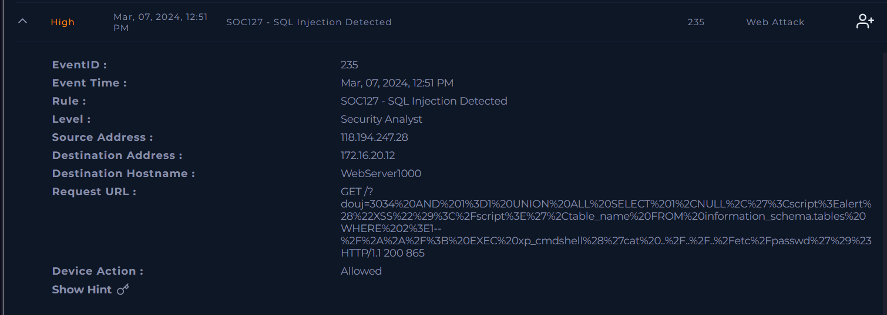
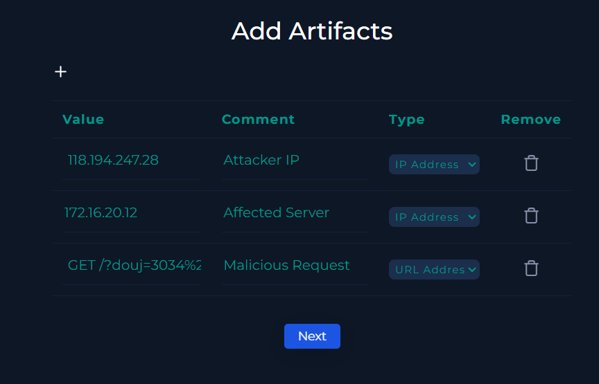

# [Write-up] SOC127 - SQL Injection Detected

## Alert Details
| Attribute | Value |
| :--- | :--- |
| **Event ID** | 235 |
| **Event Time** | Mar 07, 2024, 12:51 PM |
| **Rule** | SOC127 - SQL Injection Detected |
| **Level** | Security Analyst |
| **Source IP** | `118.194.247.28` |
| **Destination IP** | `172.16.20.12` (WebServer1000) |
| **Device Action** | **Allowed** |

---

## Incident Analysis

### 1. IP Reputation (OSINT)
I began the investigation by checking the reputation of the attacker's IP address (`118.194.247.28`) on **VirusTotal**. The IP is flagged as **malicious** and has been previously associated with phishing and scanning activities.

### 2. Payload Deciphering
The Request URL contained heavy URL encoding. I used **CyberChef** to perform a `URL Decode` to analyze the attacker's intent.

**Original Encoded URL:**
`GET /?douj=3034%20AND%201%3D1%20UNION%20ALL%20SELECT%201%2CNULL%2C%27%3Cscript%3Ealert%28%22XSS%22%29%3C%2Fscript%3E%27%2Ctable_name%20FROM%20information_schema.tables%20WHERE%202%3E1--%2F%2A%2A%2F%3B%20EXEC%20xp_cmdshell%28%27cat%20..%2F..%2F..%2Fetc%2Fpasswd%27%29%23`

**Decoded Payload:**
GET /?douj=3034 AND 1=1 UNION ALL SELECT 1,NULL,'',table_name FROM information_schema.tables WHERE 2>1--/**/; EXEC xp_cmdshell('cat ../../../etc/passwd')#

### 3. Identified Attack Vectors
The decoded payload reveals a sophisticated Multi-Vector Attack:

* **SQL Injection (SQLi):** The use of AND 1=1 and UNION ALL SELECT indicates an attempt to extract sensitive database information from information_schema.tables.
* **Cross-Site Scripting (XSS):** The injection of  was used to test if the application is vulnerable to client-side script execution.
* **Remote Code Execution (RCE):** The most critical finding is the use of EXEC xp_cmdshell to run the OS command cat /etc/passwd. This proves the attacker was attempting to compromise the underlying server and access system credentials.

### 4. Log Investigation
Upon checking the Log Management system, I found a high volume of similar requests from this source IP. Since the Device Action was Allowed and the server returned an HTTP 200 OK, it is highly probable that the malicious request was successfully processed by the web application.

---

## Case Management & Resolution
I provided the following details during the case creation:

* **Is Traffic Malicious?** Yes (Confirmed via payload analysis).
* **What Is The Attack Type?** SQL Injection.
* **Check If It Is a Planned Test:** No (No prior notification or scheduled penetration tests found).
* **Direction of Traffic:** Internet -> Company Network.
* **Was the Attack Successful?** Yes (Based on Status 200 and 'Allowed' action).
* **Add Artifacts:** 
* **Do You Need Tier 2 Escalation?** Yes (High risk of RCE and system compromise).

### Analyst Note
Confirmed True Positive multi-vector attack from 118.194.247.28 against WebServer1000. Decoded payload reveals SQL Injection (UNION SELECT, information_schema), XSS (), and RCE (xp_cmdshell for /etc/passwd). Device action was 'Allowed', indicating the malicious request reached the server. Source IP is blacklisted with persistent attack history in logs. Due to the high risk of RCE and data exfiltration, immediate escalation and host containment are required.

---

## Result

---

## Lessons Learned
This incident highlights the importance of a layered defense strategy. To mitigate these risks, the following should be implemented:
1. **Prepared Statements:** Use parameterized queries to prevent SQL Injection at the code level.
2. **WAF Tuning:** Update Web Application Firewall rules to block common SQLi patterns and dangerous procedures like xp_cmdshell.
3. **Database Hardening:** Disable xp_cmdshell if not required and enforce the Principle of Least Privilege for database users.
4. **Input Validation:** Implement strict server-side validation and output encoding to prevent XSS.