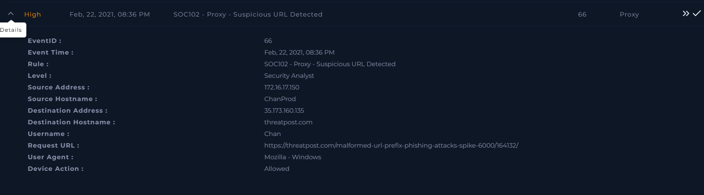
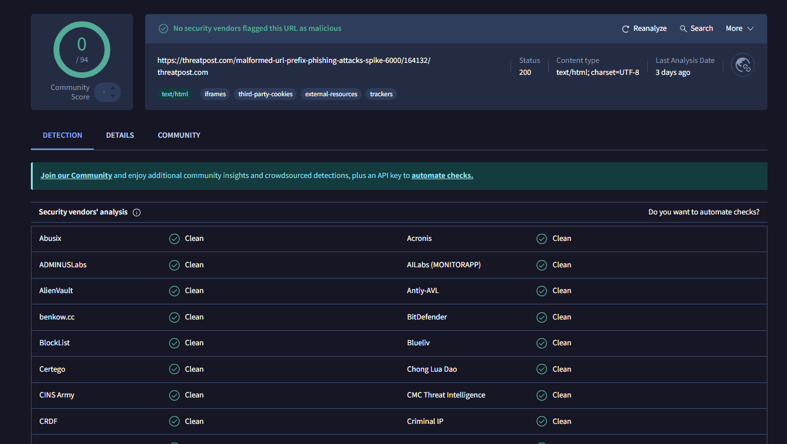
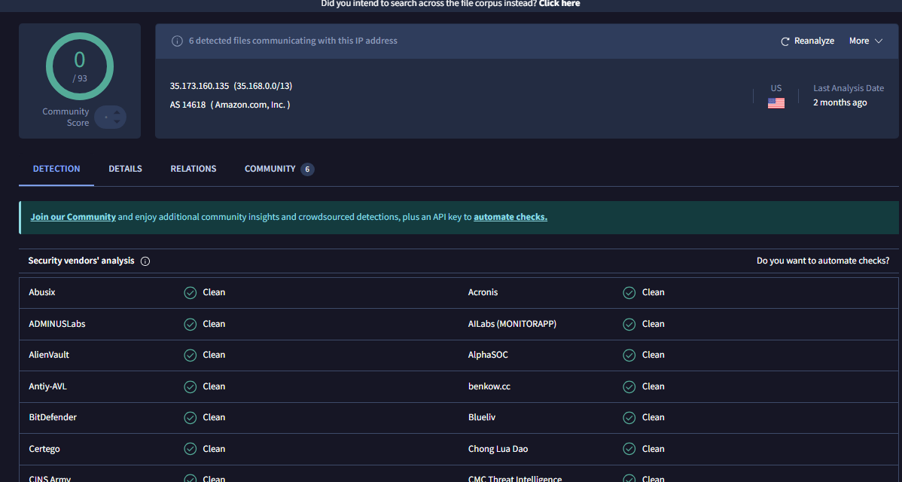
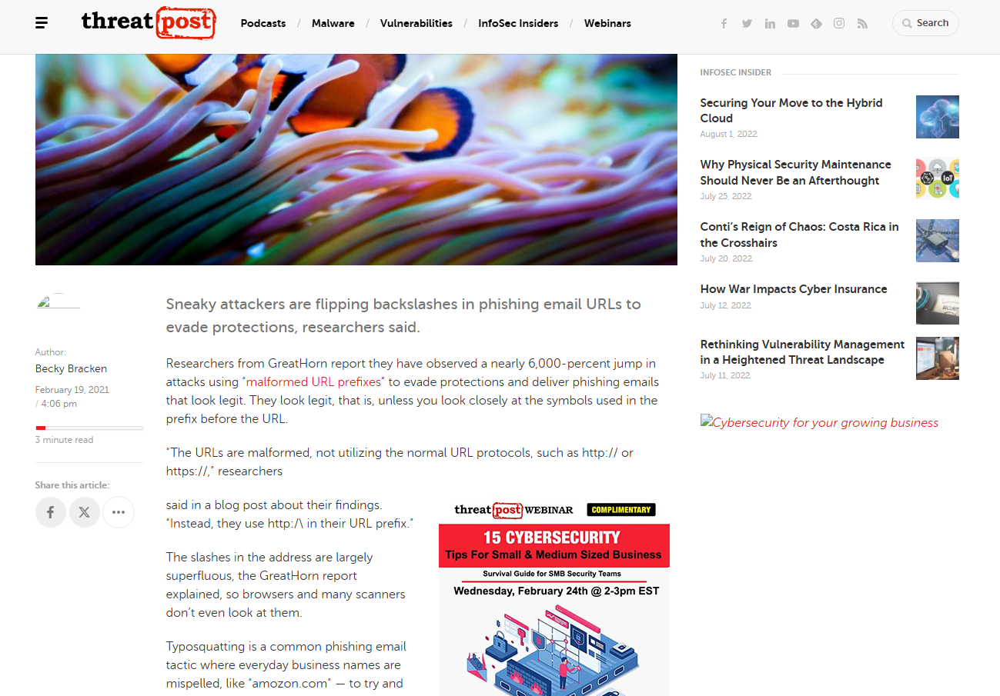
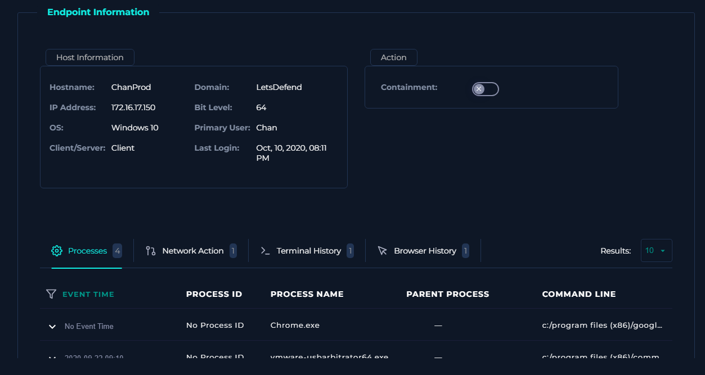
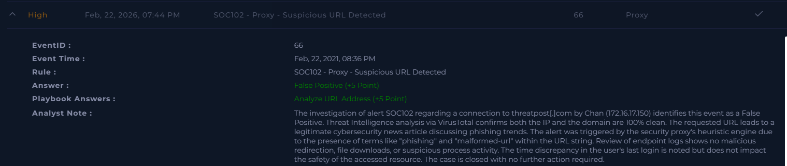

# [Write-up] SOC102 - Proxy - Suspicious URL Detected

## Alert Details
| Attribute | Value |
| :--- | :--- |
| **Event ID** | 66 |
| **Event Time** | Feb 22, 2021, 08:36 PM |
| **Rule** | SOC102 - Proxy - Suspicious URL Detected |
| **Level** | Security Analyst |
| **Source IP** | `172.16.17.150` (ChanProd) |
| **Destination** | `threatpost.com` |
| **Device Action** | **Allowed** |

---

## Incident Analysis

### 1. Initial Triage
The alert was triggered by user **Chan** accessing a URL that appeared suspicious to the security proxy. At first glance, the URL includes terms like "phishing" and "malformed-url", which often trigger heuristic-based alerts. My task was to determine if this was a connection to a malicious phishing site or a legitimate resource.

### 2. Threat Intelligence (OSINT)
I performed a reputation check on both the domain `threatpost.com` and the destination IP `35.173.160.135` using **VirusTotal**.
* **URL Status:** 0/94 engines detected it as malicious.
* **IP Status:** Flagged as clean by all major vendors.
The community feedback confirms that Threatpost is a well-known and trusted cybersecurity news outlet.

### 3. Website Content Verification
I manually verified the destination URL. The page is a legitimate technical article describing a recent 6,000% spike in phishing attacks using malformed URL prefixes. The content is educational and does not host any malicious scripts or forms.

### 4. Endpoint Security Check
I investigated **ChanProd** via the Endpoint Security console. 
* **Process History:** No suspicious processes were spawned during or after the connection.
* **Network Activity:** No evidence of unauthorized redirects or secondary downloads.
* **Note:** I observed a discrepancy between the alert time (Feb 2021) and the last recorded login (Oct 2020). However, given the verified safety of the destination URL and the lack of suspicious local activity, this was treated as a logging anomaly within the simulation environment.

---

## Case Management & Resolution

* **Analyze URL Address:** Non-malicious.
* **Is Traffic Malicious?** No.

### Analyst Note
> **False Positive.** The investigation of alert SOC102 regarding a connection to `threatpost[.]com` by Chan (`172.16.17.150`) identifies this event as a False Positive. Threat Intelligence analysis via VirusTotal confirms both the IP and the domain are 100% clean. The requested URL leads to a legitimate cybersecurity news article discussing phishing trends. The alert was triggered by the security proxy's heuristic engine due to the presence of security-related terms within the URL string. Review of endpoint logs shows no malicious redirection or file downloads. The case is closed with no further action required.

---

## Result

---

## Lessons Learned
This case is a classic example of a **Heuristic-based False Positive**.

1.  **Keyword Sensitivity:** Security proxies often flag URLs containing words like "phishing", "login", or "verify". Analysts must look at the **domain reputation** rather than just the keywords in the URL string.
2.  **Context Matters:** In the cybersecurity industry, employees will naturally visit security blogs. Whitelisting reputable news domains (e.g., Threatpost, BleepingComputer, KrebsOnSecurity) can help reduce alert fatigue.
3.  **Data Integrity:** Always cross-reference alert timestamps with host logs. While discrepancies should be noted, they should be weighed against the overall evidence gathered from OSINT and behavior analysis.