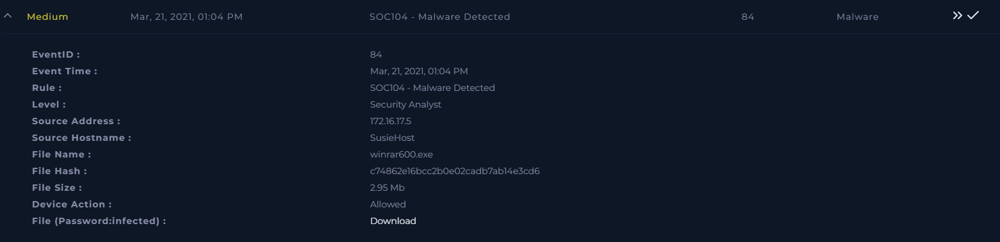
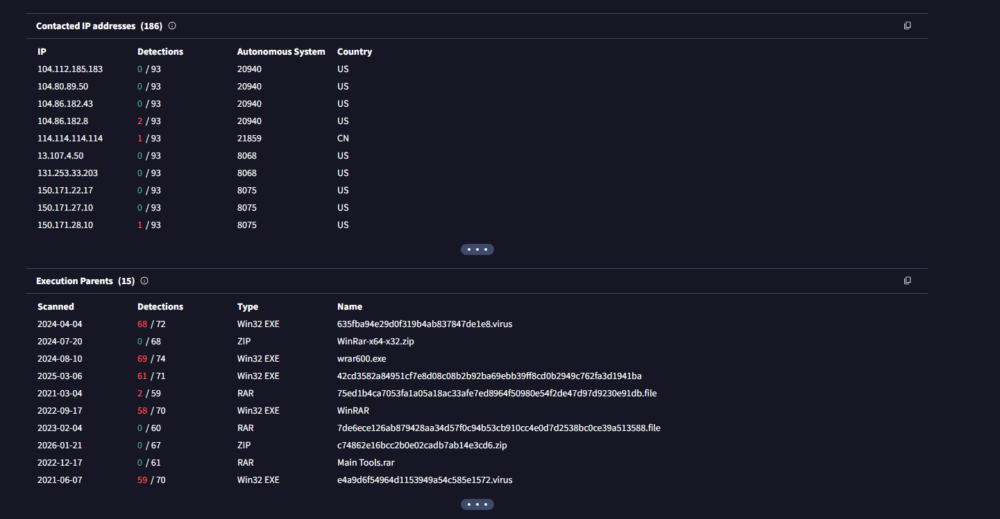

# [Write-up] SOC104 - Malware Detected

## Alert Details
| Attribute | Value |
| :--- | :--- |
| **Event ID** | 84 |
| **Event Time** | Mar 21, 2021, 01:04 PM |
| **Rule** | SOC104 - Malware Detected |
| **Level** | Security Analyst |
| **Source IP** | `172.16.17.5` |
| **Source Hostname** | `SusieHost` |
| **Device Action** | **Allowed** |

---

## Incident Analysis

### 1. Initial Triage
The alert was triggered when a user named **Susie** downloaded an executable file named `winrar600.exe`. While the system flagged it as potential malware, initial analysis was required to determine if the file was a legitimate installer or a Trojan disguised as software.

### 2. Threat Intelligence (OSINT)
I used the file hash to check its reputation on **VirusTotal**. The results showed only one vendor flagging it as malicious, while the majority of engines marked it as clean. Community feedback indicated that while it was flagged in the past, recent analyses categorize it as a clean, legitimate file.

### 3. Log Management
I investigated the web logs for `SusieHost`. Only one relevant log entry was found, showing a connection to the official WinRAR website following the download. This behavior is consistent with a legitimate installation process.

### 4. Endpoint Security & Malware Analysis
I checked the **Endpoint Security** tool, but no suspicious processes or unauthorized changes were recorded on `SusieHost`. 

To be certain, I performed a dynamic analysis using **AnyRun** (Sandbox). I monitored the file's behavior for:
* Suspicious registry modifications.
* Unexpected file creation in system folders.
* Malicious network connections.

The analysis confirmed that the file is a **legitimate WinRAR installer**.

---

## Case Management & Resolution
I provided the following findings during the case creation:

* **Select Threat Indicator:** Other.
* **Malware Quarantined/Cleaned?** Not Quarantined.
* **Analyze Malware:** Non-Malicious.
* **Artifacts:** 

### Analyst Note
> **False Positive.** Investigation of alert SOC104 regarding the file `winrar600.exe` identifies this event as a False Positive. While initially flagged, multi-source Threat Intelligence (VirusTotal) and dynamic analysis via AnyRun confirm the file is a legitimate WinRAR installer with no malicious behavior or suspicious network connections. Log management shows only a standard connection to the official WinRAR website. No signs of infection were found on SusieHost.

---

## Result

---

## Lessons Learned
False Positives are a common occurrence in SOC operations. This case taught us several key points:

1.  **Verification is Key:** Never rely solely on an automated alert. Multi-layered verification (Hash lookup + Sandbox analysis) is essential to avoid business disruption.
2.  **Contextual Analysis:** Checking web logs to see the source of the download (official site vs. suspicious domain) provides critical context.
3.  **Reducing False Positives:** To minimize such alerts in the future, the organization can:
    * Whitelist hashes of known-good, company-approved software.
    * Fine-tune the EDR/AV sensitivity for commonly used administrative tools.
    * Maintain an internal repository of "Known Good" software installers for users.