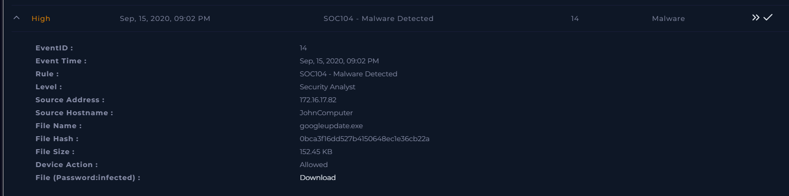
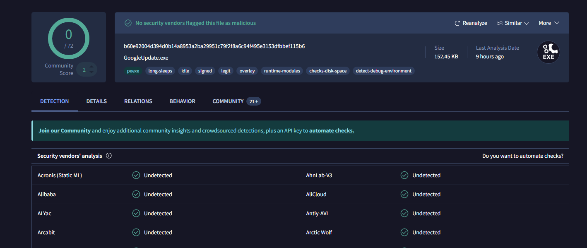
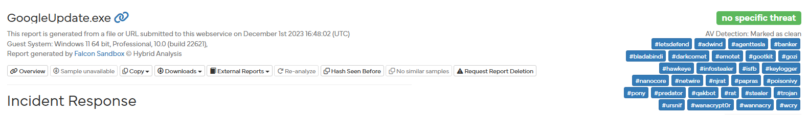
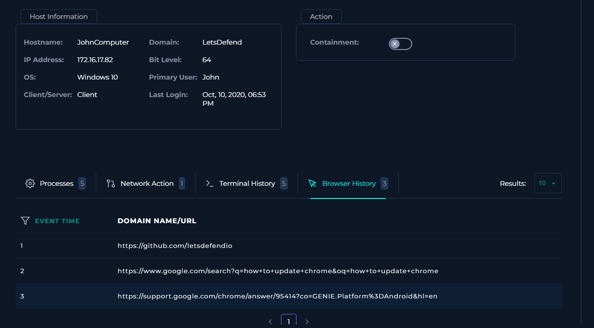
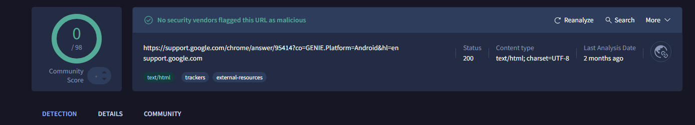
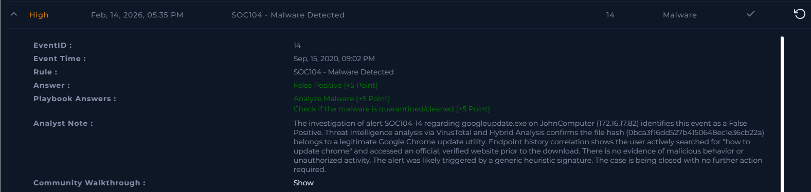

# [Write-up] SOC104-14 - Malware Detected

## Alert Details
| Attribute | Value |
| :--- | :--- |
| **Event ID** | 14 |
| **Event Time** | Sep 15, 2020, 09:02 PM |
| **Rule** | SOC104 - Malware Detected |
| **Level** | Security Analyst |
| **Source IP** | `172.16.17.82` |
| **Source Hostname** | `JohnComputer` |
| **File Name** | `googleupdate.exe` |
| **Device Action** | **Allowed** |

---

## Incident Analysis

### 1. Initial Triage
The alert was triggered by the detection of a file named `googleupdate.exe`. Attackers often use names of legitimate software utilities (like Google Update) to mask Trojans or miners. My investigation focused on verifying whether this file was a legitimate Google utility or a malicious masquerading attempt.

### 2. Threat Intelligence (OSINT)
I analyzed the provided file hash (`0bca3f16dd527b4150648ec1e36cb22a`) using **VirusTotal**. The reputation check confirmed that the file is widely recognized as a legitimate Google Chrome update utility.

To further ensure there were no hidden malicious capabilities or code injection, I checked the report on **Hybrid Analysis**. The sandbox execution results confirmed the file's safe behavior, verifying it as a genuine updater.

### 3. Endpoint Security & User Behavior
Analysis of **JohnComputer** provided crucial context for the file download:
* **Browser History:** The user explicitly searched for "how to update chrome" shortly before the alert.
* **Source Verification:** The download originated from an official domain. A reputation check of the URL in VirusTotal confirmed the site is legitimate and safe.

### 4. Investigation Summary
There is no evidence of malicious activity on the endpoint. The file name, hash, and user intent all point to a routine software update performed by the user.

---

## Case Management & Resolution

* **Select Threat Indicator:** Other.
* **Malware Quarantined/Cleaned?** Not Quarantined.
* **Analyze Malware:** Non-malicious.

### Analyst Note
> **False Positive.** The investigation of alert SOC104-14 regarding googleupdate.exe on JohnComputer (172.16.17.82) identifies this event as a False Positive. Threat Intelligence analysis via VirusTotal and Hybrid Analysis confirms the file hash (0bca3f16dd527b4150648ec1e36cb22a) belongs to a legitimate Google Chrome update utility. Endpoint history correlation shows the user actively searched for "how to update chrome" and accessed an official, verified website prior to the download. There is no evidence of malicious behavior or unauthorized activity. The alert was likely triggered by a generic heuristic signature. The case is being closed with no further action required.

---

## Result

---

## Lessons Learned
This incident highlights the importance of **User Context** in alert triage:

1.  **Contextual Verification:** A file that looks suspicious by name (often used in masquerading) can be quickly cleared by looking at the user's browser history and intent.
2.  **Heuristic Over-sensitivity:** Security tools often flag legitimate administrative or update tools because they perform system-level changes. 
3.  **Efficiency in Triage:** By combining Hash Reputation (Static Analysis) with Sandbox reports (Dynamic Analysis) and User Behavior, an analyst can confidently identify False Positives without escalating unnecessary incidents, saving time for real threats.