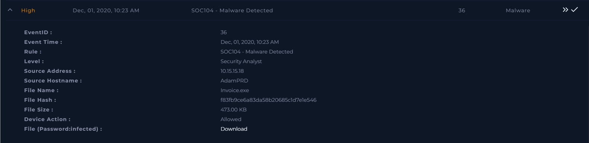
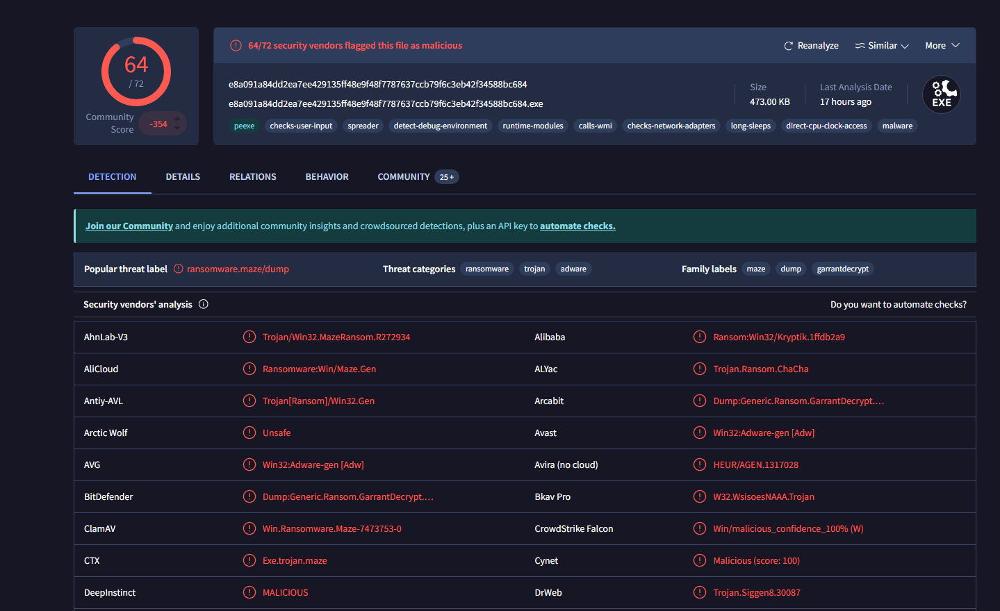
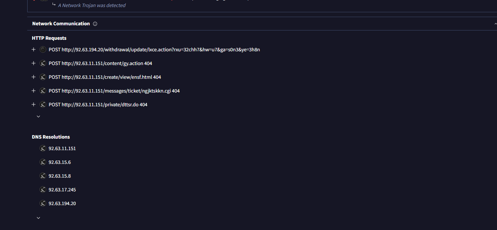
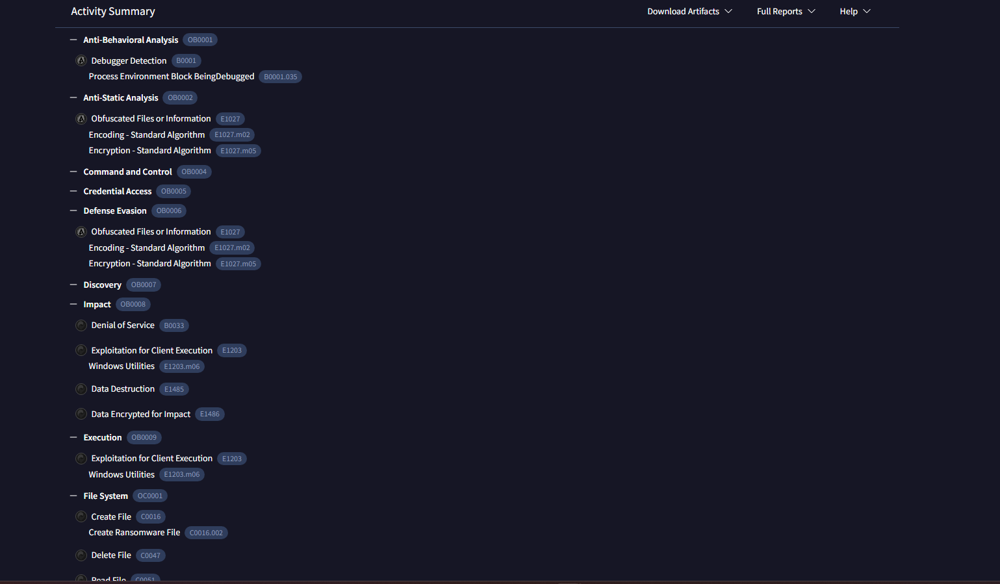
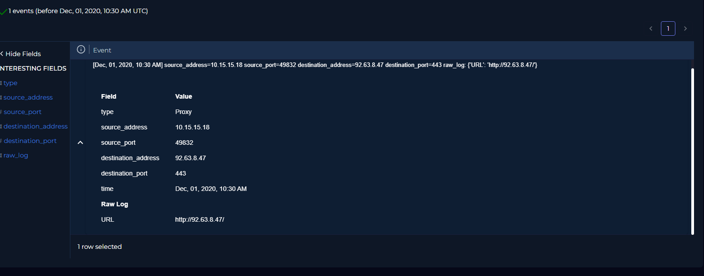
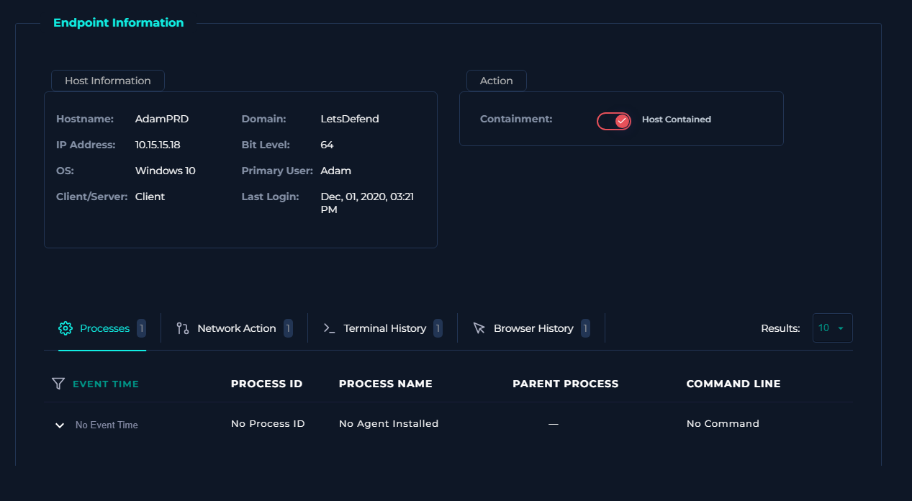
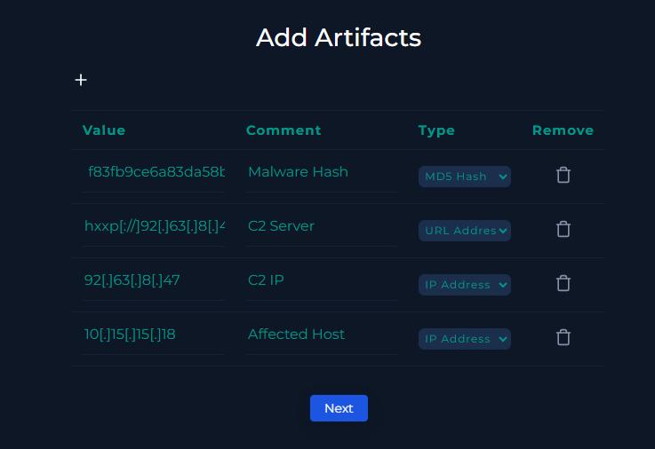
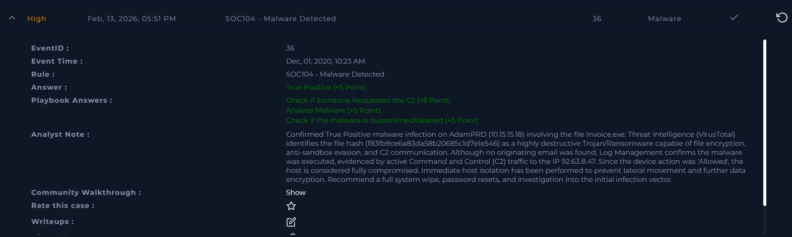

# [Write-up] SOC104-36 - Malware Detected (Ransomware Attack)

## Alert Details
| Attribute | Value |
| :--- | :--- |
| **Event ID** | 36 |
| **Event Time** | Dec 01, 2020, 10:23 AM |
| **Rule** | SOC104 - Malware Detected |
| **Level** | Security Analyst |
| **Source IP** | `10.15.15.18` |
| **Source Hostname** | `AdamPRD` |
| **File Name** | `Invoice.exe` |
| **Device Action** | **Allowed** |

---

## Incident Analysis

### 1. Initial Triage
The alert identifies a suspicious download of `Invoice.exe` on **AdamPRD**. Executables masquerading as invoices are a classic hallmark of phishing campaigns. These files are typically designed to trick users into executing malware that grants attackers remote control or encrypts local data. Immediate verification was required due to the "Allowed" device action.

### 2. Email Investigation
I performed a search in **Email Security** to identify the delivery vector. No emails addressed to Adam or other employees containing this file were found during the relevant timeframe. This suggests the malware may have been delivered via a direct download link, a compromised website, or an external drive.

### 3. Threat Intelligence (Static & Behavior Analysis)
Analysis of the file hash (`f83fb9ce6a83da58b20685c1d7e1e546`) on **VirusTotal** yielded critical results. The file is flagged by most vendors as a **Trojan/Ransomware**.

Further behavioral analysis reveals high-risk capabilities:
* **File Destruction:** Capability to encrypt, modify, and delete user files.
* **Evasion:** Anti-sandbox techniques to detect virtual environments and avoid analysis.
* **Persistence:** Mechanisms to remain active after system reboots.
* **C2 Communication:** Hardcoded infrastructure for Command and Control (C2).

Verified C2 indicators from OSINT include:
* `hxxp[://]92[.]63[.]11[.]151`
* `hxxp[://]92[.]63[.]194[.]20`

### 4. Log Management (Confirmed Execution)
Checking the **Log Management** system confirmed the worst-case scenario. I identified active outbound traffic from `10.15.15.18` to the malicious IP `92.63.8.47`. This proves the malware was executed and successfully established a connection with the attacker's infrastructure.

### 5. Containment & Endpoint Security
I accessed the **Endpoint Security** console to investigate process trees. While no specific command-line evidence was available (potentially due to the malware's evasion techniques), the confirmed C2 traffic justified immediate containment. **AdamPRD was isolated from the network** to prevent lateral movement and further data exfiltration.

---

## Case Management & Resolution

* **Select Threat Indicator:** Other.
* **Malware Quarantined/Cleaned?** Not Quarantined.
* **Analyze Malware:** Malicious.
* **Check If Someone Requested the C2:** Accessed.

### Analyst Note
> **True Positive.** Confirmed True Positive malware infection on AdamPRD (10.15.15.18) involving the file Invoice.exe. Threat Intelligence (VirusTotal) identifies the file hash (f83fb9ce6a83da58b20685c1d7e1e546) as a highly destructive Trojan/Ransomware capable of file encryption, anti-sandbox evasion, and C2 communication. Although no originating email was found, Log Management confirms the malware was executed, evidenced by active Command and Control (C2) traffic to the IP 92.63.8.47. Since the device action was 'Allowed', the host is considered fully compromised. Immediate host isolation has been performed to prevent lateral movement and further data encryption. Recommend a full system wipe, password resets, and investigation into the initial infection vector.

---

## Result

---

## Lessons Learned
This incident demonstrates the high risk of ransomware in a production environment. Key takeaways include:

1. **The Danger of "Allowed" Actions:** When security tools alert on malicious files but allow the action, immediate human intervention is the only barrier to a full-scale breach.
2. **Beyond Email:** Phishing isn't limited to emails. The absence of an email record suggests the importance of monitoring web traffic and endpoint browser activity.
3. **Speed of Containment:** In ransomware cases, seconds matter. Automated or rapid manual host isolation is the most effective way to stop encryption from spreading to network shares.
4. **Defense in Depth:** We should implement stricter application whitelisting (AppLocker or similar) to prevent users from executing unsigned `.exe` files in their download directories.