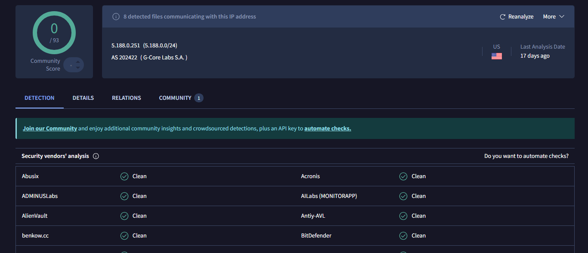
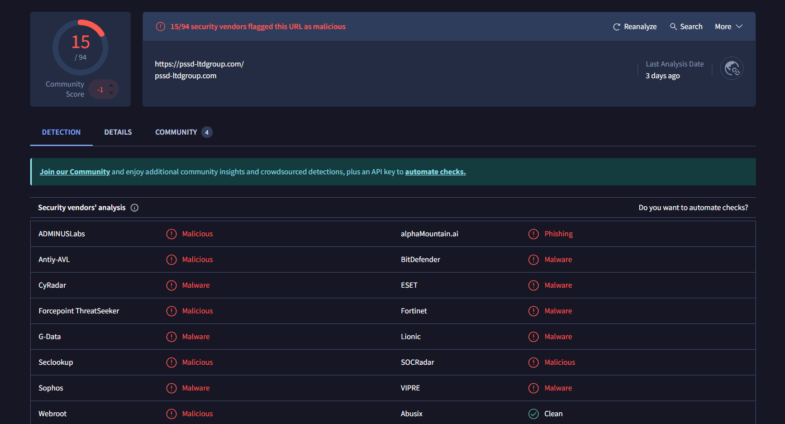
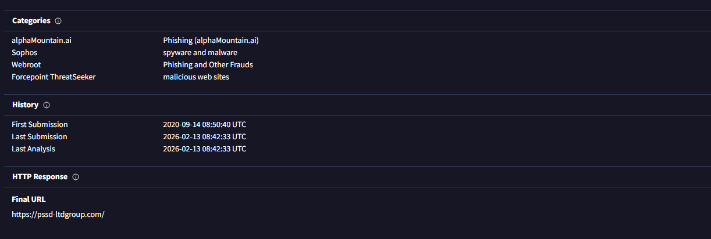
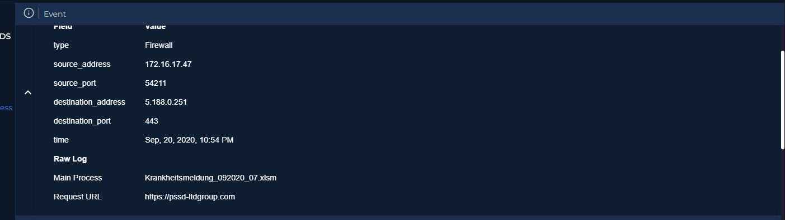
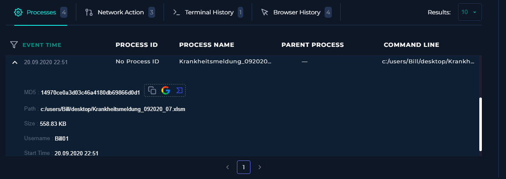
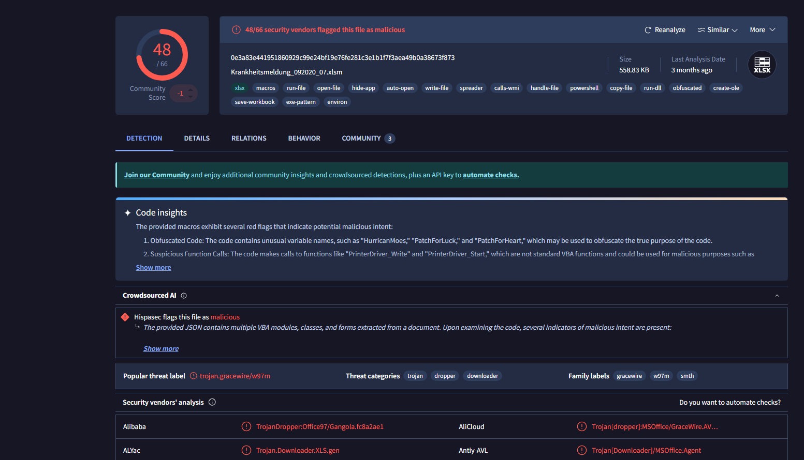
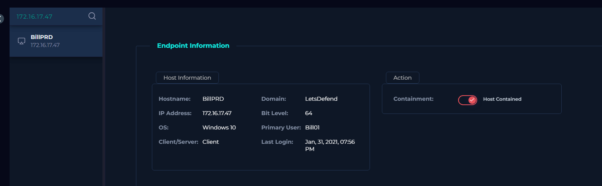
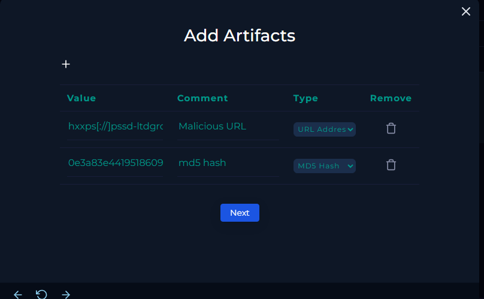
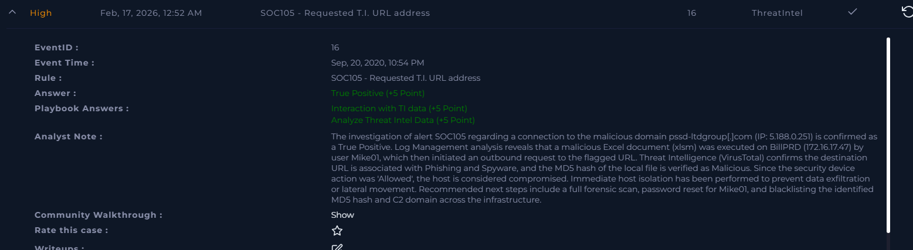

# [Write-up] SOC105-16 - Requested T.I. URL address

## Alert Details
| Attribute | Value |
| :--- | :--- |
| **Event ID** | 16 |
| **Event Time** | Sep 20, 2020, 10:54 PM |
| **Rule** | SOC105 - Requested T.I. URL address |
| **Source IP** | `172.16.17.47` (BillPRD) |
| **Destination IP** | `5.188.0.251` |
| **Destination Host** | `pssd-ltdgroup.com` |
| **Username** | `Mike01` |
| **Device Action** | **Allowed** |

---

## Incident Analysis

### 1. Initial Triage
The alert indicates that a user accessed a domain flagged in the **Threat Intelligence (T.I.)** database. Accessing blocked or blacklisted URLs poses a high risk of malware infection, credential theft, or broader infrastructure compromise. Given that the **Device Action** was **Allowed**, the connection was successful, necessitating an immediate investigation.

### 2. Threat Intelligence Verification (OSINT)
I investigated the destination IP and URL using **VirusTotal**:
* **IP (5.188.0.251):** Currently not flagged as malicious by vendors.
* **URL (pssd-ltdgroup.com):** Highly suspicious. 15 security vendors flagged this URL as **malicious**.
* **Details:** Further analysis of the T.I. data shows strong associations with **Phishing** and **Spyware** campaigns. This suggests the user might have interacted with a malicious link or executed a file that reached out to this domain.

### 3. Log Management (Behavioral Analysis)
Reviewing logs for the destination IP revealed a critical chain of events. A **malicious Excel file (.xlsm)** was executed on the system, which then initiated the Request URL to the flagged domain. Following this request, a full connection was established by the user's machine. Investigation of the email gateway showed no record of this file, suggesting it may have been delivered via alternative means (USB, direct download, or web-based chat).

### 4. Endpoint Security & Malware Identification
Upon identifying that a file triggered the network request, I accessed **Endpoint Security** to retrieve the file's **MD5 hash**. 
* **MD5 Verification:** I cross-referenced the hash on VirusTotal, which confirmed the file is **Malicious**.
* **Containment:** To prevent data exfiltration and potential lateral movement, I immediately **isolated the host (BillPRD)** from the network.

---

## Case Management & Resolution

* **Analyze Threat Intel Data:** Malicious.
* **Is there any interaction with TI data?** Accessed.
* **Artifacts:** 

### Analyst Note
> **True Positive.** The investigation of alert SOC105 regarding a connection to the malicious domain `pssd-ltdgroup[.]com` (IP: `5.188.0.251`) is confirmed as a True Positive. Log Management analysis reveals that a malicious Excel document (.xlsm) was executed on BillPRD (`172.16.17.47`) by user Mike01, which initiated an outbound request to the flagged URL. Threat Intelligence (VirusTotal) confirms the destination is associated with Phishing and Spyware, and the MD5 hash of the local file is verified as Malicious. As the device action was 'Allowed', the host is considered compromised. Immediate host isolation has been performed. Recommended next steps include a forensic scan, password reset for Mike01, and blacklisting the MD5 hash and C2 domain across the environment.

---

## Result

---

## Lessons Learned
This incident highlights the dangers of macro-enabled documents and the importance of T.I. monitoring:

1.  **Macro Security:** The use of `.xlsm` files to trigger outbound connections is a common technique for spyware delivery. Organizations should consider disabling macros for all users or restricting them to signed, trusted publishers.
2.  **Threat Intelligence Value:** Real-time T.I. feeds are crucial. While the IP appeared clean, the URL reputation provided the necessary evidence to confirm the threat.
3.  **Proactive Defense:** Since the initial delivery vector (email) was bypassed, this highlights the need for robust endpoint detection (EDR) to catch "living-off-the-land" style executions from common office applications.
4.  **Zero Trust:** "Allowed" actions on T.I. hits should be treated as high-priority emergencies, as they indicate a failure in automated blocking.