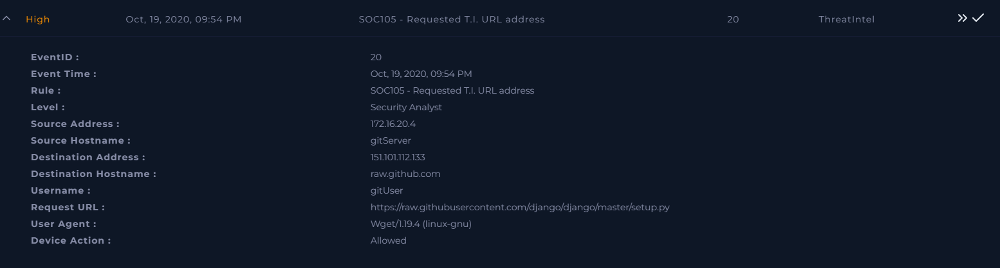
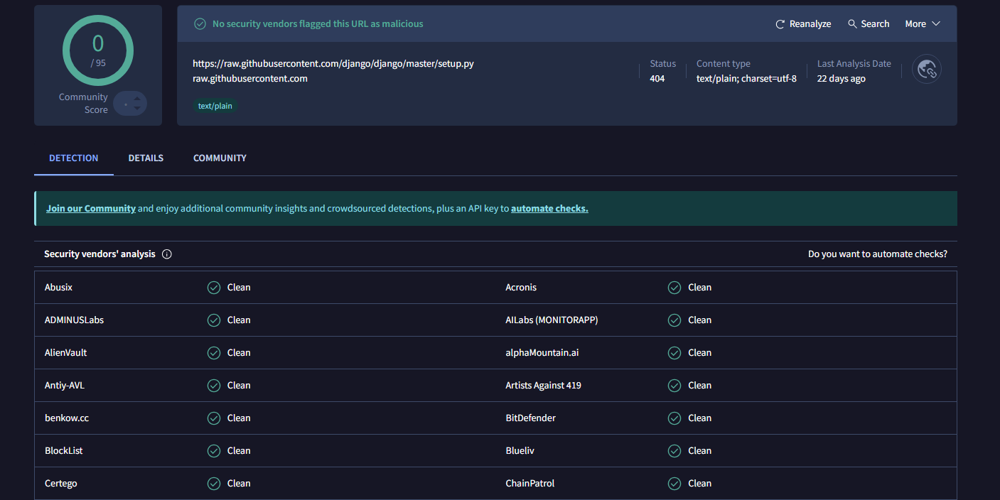
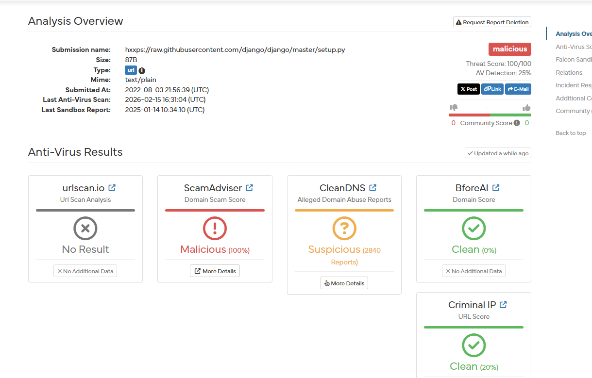
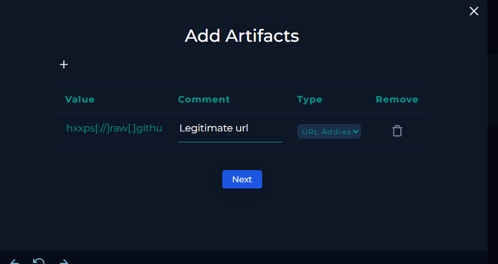
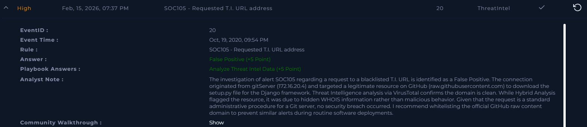

# [Write-up] SOC105-20 - Requested T.I. URL address

## Alert Details
| Attribute | Value |
| :--- | :--- |
| **Event ID** | 20 |
| **Event Time** | Oct 19, 2020, 09:54 PM |
| **Rule** | SOC105 - Requested T.I. URL address |
| **Level** | Security Analyst |
| **Source IP** | `172.16.20.4` (gitServer) |
| **Destination IP** | `151.101.112.133` |
| **Destination Host** | `raw.github.com` |
| **Username** | `gitUser` |
| **Device Action** | **Allowed** |

---

## Incident Analysis

### 1. Initial Triage
The alert indicates a request to a URL flagged in the **Threat Intelligence (T.I.)** blacklist. Such alerts often signal communication with malicious infrastructure or C2 servers. However, a preliminary review of the alert details shows a common administrative pattern: the `gitServer` is attempting to download `setup.py` for the **Django** framework—a legitimate and widely used software tool. My investigation focused on verifying whether this was a routine deployment or a masquerading threat.

### 2. Threat Intelligence Verification (OSINT)
I initiated a reputation check of the domain and file on **VirusTotal**.
* **VirusTotal:** The domain `raw.githubusercontent.com` is flagged as 100% clean by all security vendors. This is the official domain used by GitHub to serve raw file content.

* **Hybrid Analysis:** I further verified the resource using **Hybrid Analysis**. While the file was flagged by the automated sandbox, a deeper look revealed that the "malicious" rating was primarily due to the domain registrant's information being hidden in WHOIS data. This is common for many large-scale cloud providers and does not inherently indicate malicious intent.

### 3. Contextual Analysis
The connection originated from `gitServer` (172.16.20.4) using `Wget/1.19.4`. Given the server's role in the infrastructure, downloading setup scripts for developer frameworks like Django is a standard, expected procedure. The request aligns with routine software deployment and maintenance tasks.

---

## Case Management & Resolution

* **Analyze Threat Intel Data:** Non-malicious.
* **Artifacts:** 

### Analyst Note
 The investigation of alert SOC105 regarding a request to a blacklisted T.I. URL is identified as a False Positive. The connection originated from gitServer (172.16.20.4) and targeted a legitimate resource on GitHub (raw.githubusercontent.com) to download the setup.py file for the Django framework. Threat Intelligence analysis via VirusTotal confirms the domain is clean. While Hybrid Analysis flagged the resource, it was due to hidden WHOIS information rather than malicious behavior. Given that the request is a standard administrative procedure for a Git server, no security breach occurred. I recommend whitelisting the official GitHub raw content domain to prevent similar alerts during routine software deployments.

---

## Result

---

## Lessons Learned
This case highlights the nuances of heuristic-based Threat Intelligence:

1.  **Context is Everything:** An automated flag on a Git server for a well-known development script is a strong indicator of a False Positive.
2.  **Verify the "Why" behind detections:** Tools like Hybrid Analysis provide detailed reasons for their ratings. Understanding that a "Malicious" flag was triggered by WHOIS privacy rather than actual code execution is crucial for accurate triage.
3.  **Tuning the SIEM/IPS:** Official domains from trusted providers like GitHub often host raw scripts. To reduce alert fatigue, security teams should consider fine-tuning rules or whitelisting specific official repositories used for internal deployments.