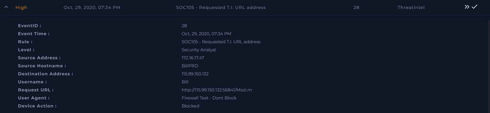
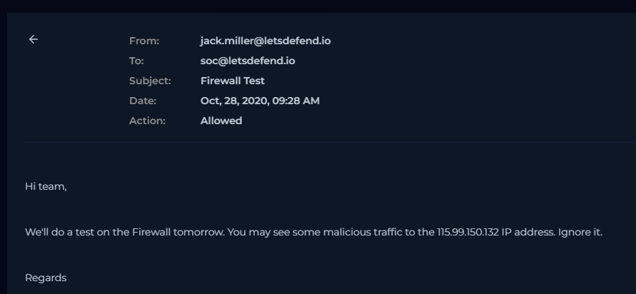
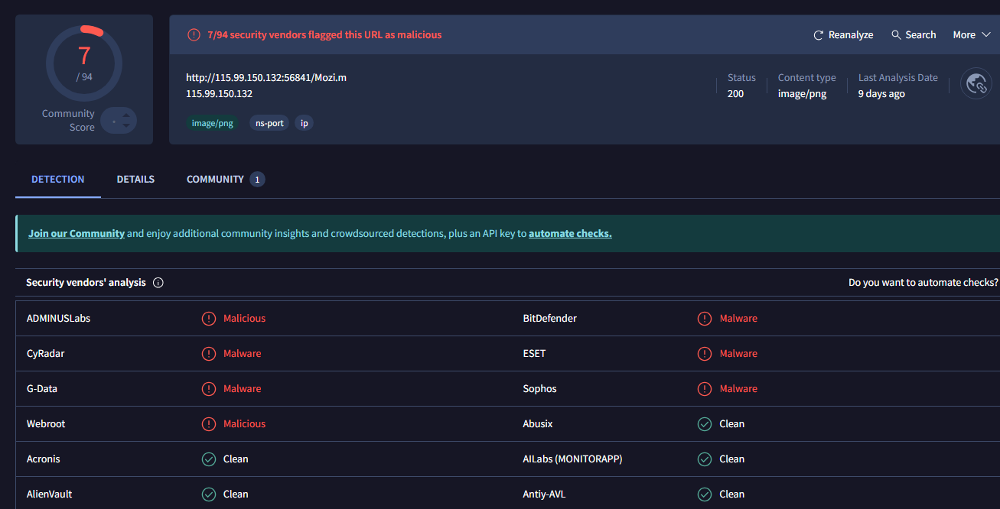
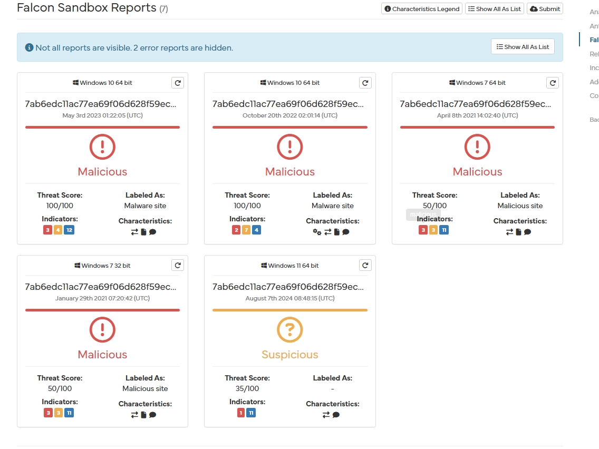
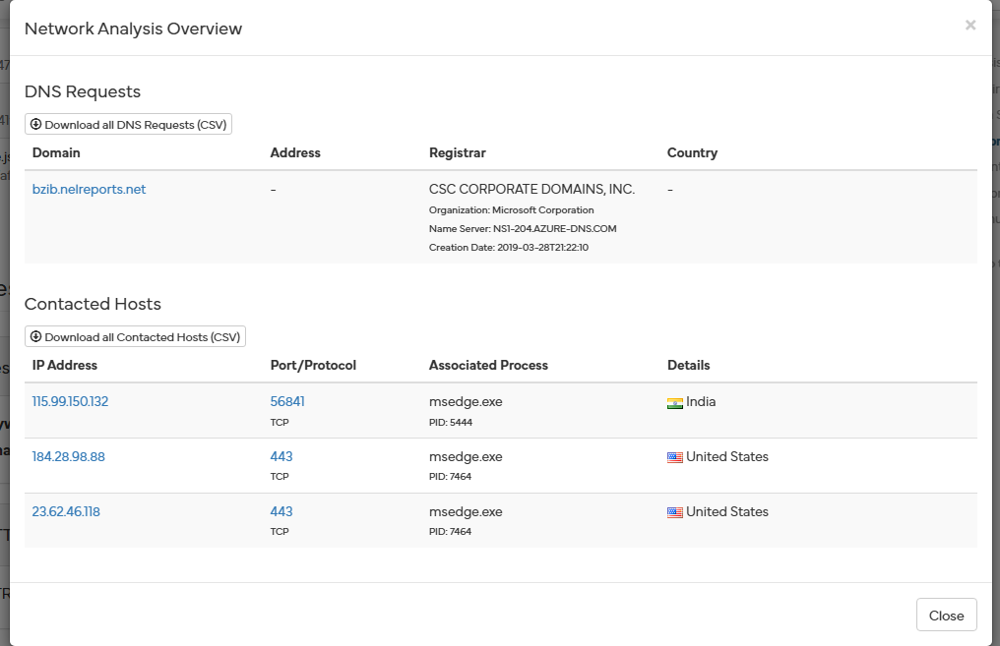
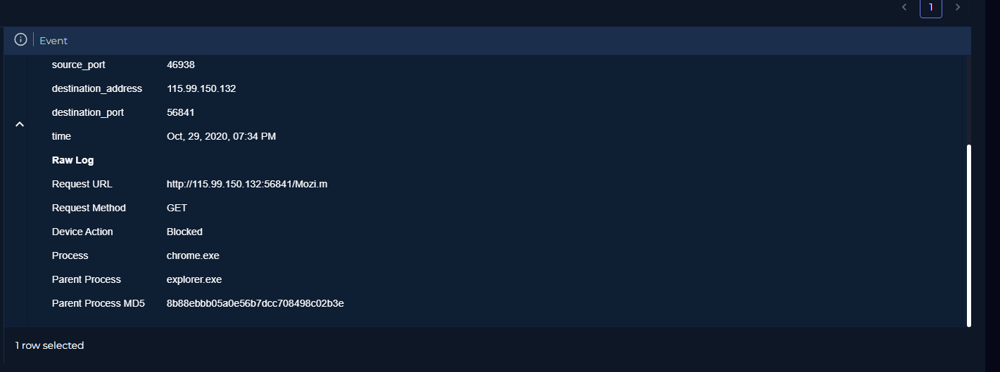
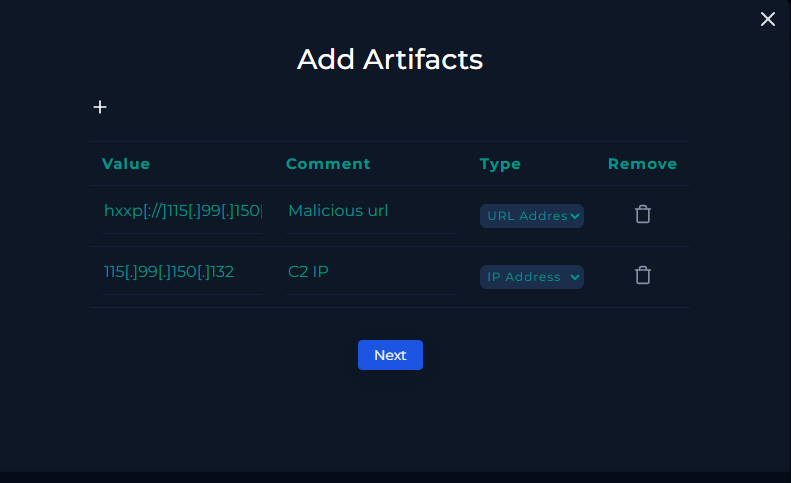
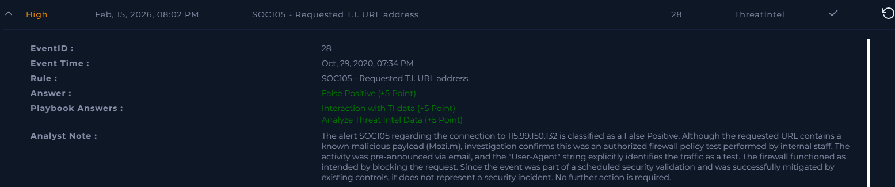

# [Write-up] SOC105-28 - Requested T.I. URL address

## Alert Details
| Attribute | Value |
| :--- | :--- |
| **Event ID** | 28 |
| **Event Time** | Oct 29, 2020, 07:34 PM |
| **Rule** | SOC105 - Requested T.I. URL address |
| **Level** | Security Analyst |
| **Source IP** | `172.16.17.47` (BillPRD) |
| **Destination** | `115.99.150.132` |
| **User Agent** | `Firewall Test - Dont Block` |
| **Device Action** | **Blocked** |

---

## Incident Analysis

### 1. Initial Triage
The alert identifies an attempted connection to a resource on the Threat Intelligence blacklist: `http://115.99.150.132:56841/Mozi.m`. Accessing such resources usually indicates a high-risk infection. However, the **Device Action** shows the connection was successfully **Blocked**. Additionally, the **User-Agent** string explicitly mentions a "Firewall Test," suggesting this might be a planned security validation.

### 2. Email Security Verification
To confirm if this was an authorized activity, I investigated the **Email Security** logs. I discovered a notification email sent 24 hours prior, informing the SOC team about scheduled firewall policy testing. This aligns perfectly with the activity seen in the alert.

### 3. Threat Intelligence & Malware Analysis
Despite being a test, I analyzed the target file (`Mozi.m`) to understand what the firewall was being tested against:
* **VirusTotal:** Confirmed the file as **malicious**.
* **Hybrid Analysis:** The file is associated with **Spyware** and **C2 communication**.
* **MITRE ATT&CK:** The malware is designed to gather information about security software and active processes on the host. The destination IP `115.99.150.132` acts as the C2 server.

### 4. Log Management
Reviewing the logs confirmed that only the authorized internal staff member attempted to communicate with this IP address. This reinforces the conclusion that the activity was contained and part of a controlled test environment.

---

## Case Management & Resolution

* **Analyze Threat Intel Data:** Malicious.
* **Interaction with TI data:** Not Accessed.
* **Result:** **False Positive** (Authorized Testing).

#### Analyst Note
 The alert SOC105 regarding the connection to 115.99.150.132 is classified as a False Positive. Although the requested URL contains a known malicious payload (Mozi.m), investigation confirms this was an authorized firewall policy test performed by internal staff. The activity was pre-announced via email, and the "User-Agent" string explicitly identifies the traffic as a test. The firewall functioned as intended by blocking the request. Since the event was part of a scheduled security validation and was successfully mitigated by existing controls, it does not represent a security incident. No further action is required.

---

## Result

---

## Lessons Learned
This case highlights the importance of internal communication and log context:

1. **Pre-announcement Value:** Timely internal notifications about security tests prevent unnecessary escalation and save SOC resources.
2. **User-Agent Integrity:** In this instance, the User-Agent was a key indicator of intent. However, analysts must always verify this against other sources (like emails), as attackers can also spoof User-Agent strings.
3. **Control Validation:** The fact that the firewall correctly identified and blocked a known malicious payload (Mozi botnet variant) proves that the current security configuration is effective.
4. **False Positive Classification:** Even though the destination was truly malicious, the *incident* is a False Positive because the activity was authorized and expected.