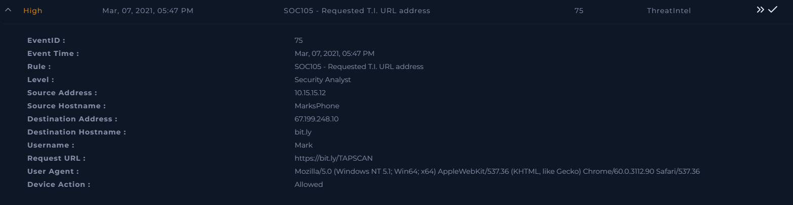
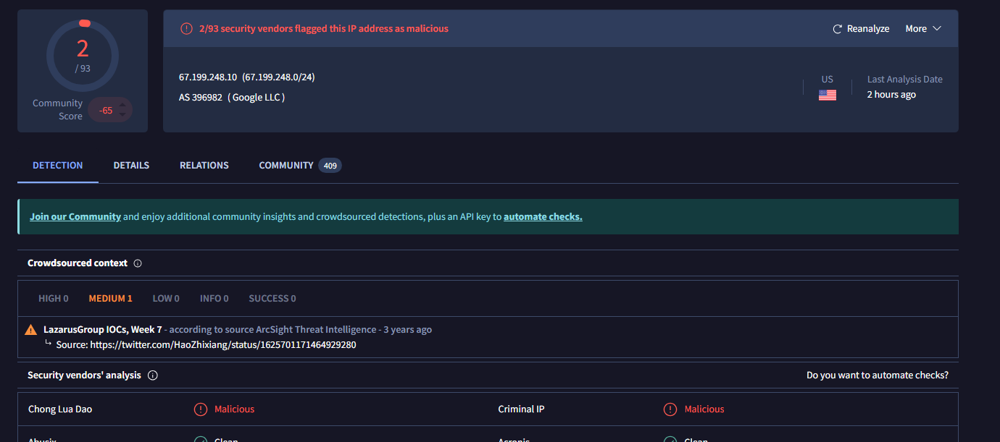
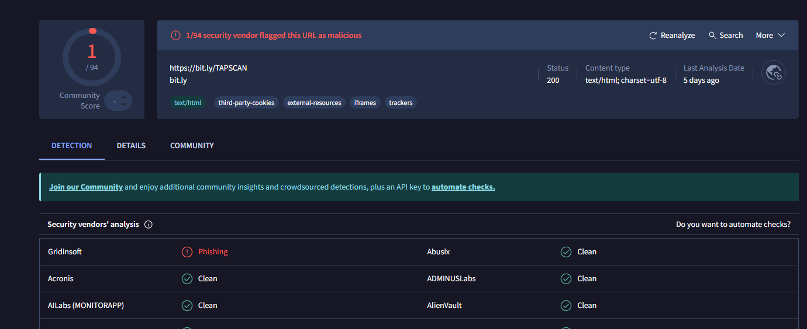
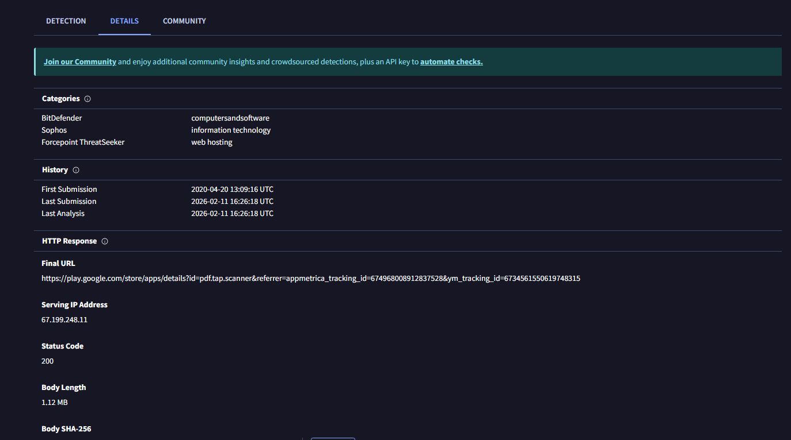
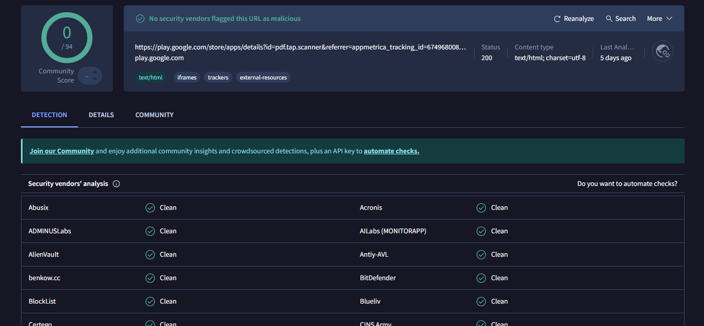
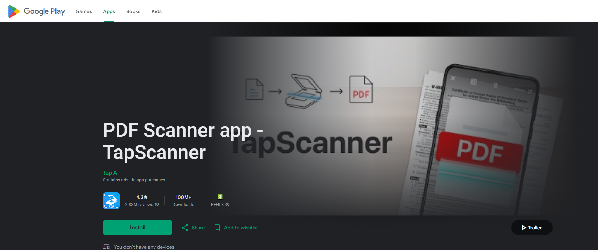
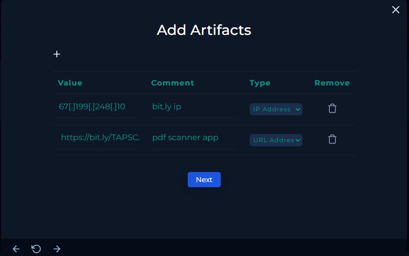
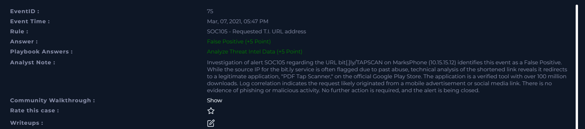

# [Write-up] SOC105-75 - Requested T.I. URL address

## Alert Details
| Attribute | Value |
| :--- | :--- |
| **Event ID** | 75 |
| **Event Time** | Mar 07, 2021, 05:47 PM |
| **Rule** | SOC105 - Requested T.I. URL address |
| **Level** | Security Analyst |
| **Source IP** | `10.15.15.12` (MarksPhone) |
| **Destination IP** | `67.199.248.10` |
| **Destination Host** | `bit.ly` |
| **Username** | `Mark` |
| **Request URL** | `https://bit.ly/TAPSCAN` |
| **Device Action** | **Allowed** |

---

## Incident Analysis

### 1. Initial Triage
The alert was triggered by a connection to a URL flagged in the **Threat Intelligence (T.I.)** database. The user accessed a shortened link: `bit.ly/TAPSCAN`. While most malicious shortened links use randomly generated characters, this one uses a specific string ("TAPSCAN"). Given that the connection was **Allowed**, it was necessary to verify whether the redirect leads to a phishing site or a legitimate resource.

### 2. Threat Intelligence Verification (OSINT)
I performed a reputation check on both the destination IP and the specific URL:
* **IP (67.199.248.10):** Flagged by some vendors as malicious. This is primarily due to the IP belonging to the `bit.ly` service, which is frequently abused by attackers to mask malicious domains.
* **URL:** One vendor flagged it as phishing. However, further analysis of the URL's redirect behavior was required.

### 3. Redirect & Destination Analysis
By examining the URL details on VirusTotal, I identified the final destination of the `bit.ly/TAPSCAN` link.
* **Redirect Path:** The link redirects to the official **Google Play Store**.
* **Target Application:** The destination is a mobile application named **"PDF Tap Scanner."**

Further verification of the Play Store link confirmed it is a legitimate resource. The application itself is a popular utility for scanning documents with over **100 million downloads**, indicating it is a verified and trusted tool.

### 4. Log Management & Context
Reviewing the network logs showed a single entry for the shortened link request. The context suggests the user likely clicked on a mobile advertisement or a social media link while using their phone (**MarksPhone**). No further suspicious outbound traffic was detected following the redirect to the official app store.

---

## Case Management & Resolution

* **Analyze Threat Intel Data:** Non-malicious.
* **Artifacts:** 

#### Analyst Note
 **False Positive.** Investigation of alert SOC105 regarding the URL bit[.]ly/TAPSCAN on MarksPhone (10.15.15.12) identifies this event as a False Positive. While the source IP for the bit.ly service is often flagged due to past abuse, technical analysis of the shortened link reveals it redirects to a legitimate application, "PDF Tap Scanner," on the official Google Play Store. The application is a verified tool with over 100 million downloads. Log correlation indicates the request likely originated from a mobile advertisement or social media link. There is no evidence of phishing or malicious activity. No further action is required, and the alert is being closed.

---

## Result

---

## Lessons Learned
This case illustrates the challenges of monitoring URL shorteners in a SOC environment:

1. **Service Reputation vs. Specific URL:** Services like `bit.ly` often have a "dirty" IP reputation due to mass abuse, but the individual links they host may be perfectly safe.
2. **The Importance of Redirect Analysis:** An analyst should always look "behind" a shortened link to find the final destination (Final URL) before making a judgment.
3. **User Intent & Advertising:** Connections to official app stores originating from mobile devices are frequently triggered by in-app ads. While annoying, they are generally not a security threat unless they lead to unauthorized third-party stores.
4. **Whitelisting Considerations:** While we cannot whitelist `bit.ly` entirely, verifying popular and legitimate redirects can help speed up triage for similar heuristic alerts.