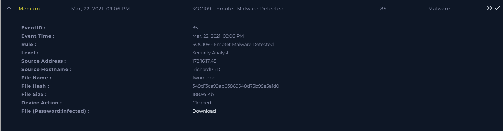
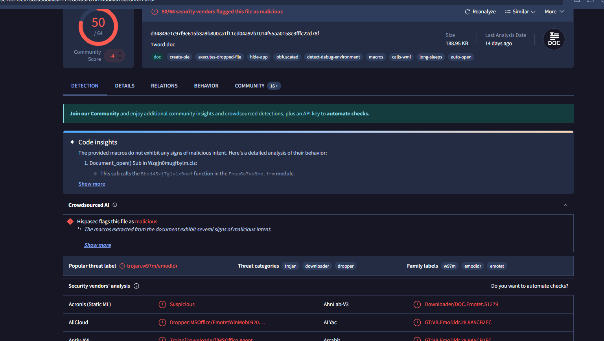
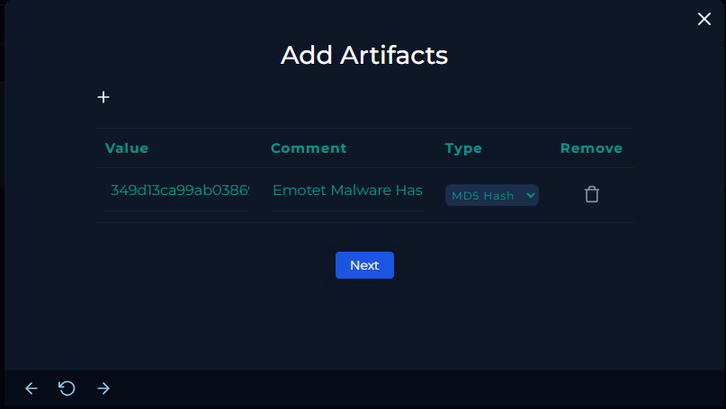
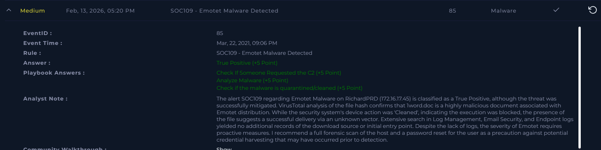

# [Write-up] SOC109 - Emotet Malware Detected

## Alert Details
| Attribute | Value |
| :--- | :--- |
| **Event ID** | 85 |
| **Event Time** | Mar 22, 2021, 09:06 PM |
| **Rule** | SOC109 - Emotet Malware Detected |
| **Level** | Security Analyst |
| **Source IP** | `172.16.17.45` |
| **Source Hostname** | `RichardPRD` |
| **File Name** | `1word.doc` |
| **File Hash** | `349d13ca99ab03869548d75b99e5a1d0` |
| **Device Action** | **Cleaned** |

---

## Incident Analysis

### What is Emotet Malware?
**Emotet** is one of the most dangerous and prevalent banking Trojans in the world. Initially designed to steal financial credentials, it has evolved into a "dropper" or "malware-as-a-service" (MaaS). It is primarily spread through spam emails (malspam) containing malicious attachments, like the Word document found in this alert. Once it infects a system, it can steal sensitive data, spread laterally through the network, and deliver other high-risk payloads, such as ransomware.

### 1. Initial Triage
The alert identifies a malicious file named `1word.doc` detected on **RichardPRD**. Although the security system reports the action as **Cleaned**, indicating the threat was neutralized, the fact that the file reached the endpoint suggests a breakdown in perimeter security. My investigation focused on determining the infection vector to prevent future occurrences.

### 2. Threat Intelligence (OSINT)
I analyzed the provided file hash (`349d13ca99ab03869548d75b99e5a1d0`) on **VirusTotal**. The reputation check confirms that the file is widely recognized as a highly malicious document (MalDoc) and is flagged by a vast majority of security vendors as part of an **Emotet** campaign.

### 3. Log Investigation
I conducted an extensive search across **Log Management**, **Email Security**, and **Endpoint Security** consoles. Unfortunately, no logs were available for the timeframe of the incident that could link the file to a specific download source, website, or email attachment. Despite the lack of an identifiable entry point, the presence of the file itself confirms a successful delivery.

---

## Case Management & Resolution

* **Select Threat Indicator:** Other.
* **Malware Quarantined/Cleaned?** Quarantined.
* **Analyze Malware:** Malicious.
* **Check If Someone Requested the C2:** Not Accessed.
* **Artifacts:** 

### Analyst Note
**True Positive.** The alert SOC109 regarding Emotet Malware on RichardPRD (172.16.17.45) is classified as a True Positive, although the threat was successfully mitigated. VirusTotal analysis of the file hash confirms that 1word.doc is a highly malicious document associated with Emotet distribution. While the security system's device action was 'Cleaned', indicating the execution was blocked, the presence of the file suggests a successful delivery via an unknown vector. Extensive search in Log Management, Email Security, and Endpoint logs yielded no additional records of the download source or initial entry point. Despite the lack of logs, the severity of Emotet requires proactive measures. I recommend a full forensic scan of the host and a password reset for the user as a precaution against potential credential harvesting that may have occurred prior to detection.

---

## Result

---

## Lessons Learned
This incident highlights both the effectiveness of endpoint protection and the challenges of visibility:

1.  **Successful Defense-in-Depth:** The antivirus/EDR functioned correctly by blocking and cleaning the malicious file before it could execute its payload.
2.  **Visibility Gaps:** The absence of logs in the SIEM/Email Gateway makes it difficult to patch the initial vulnerability. This underscores the need for longer log retention periods and better integration between security tools.
3.  **Proactive Response to High-Severity Threats:** For malware as dangerous as Emotet, "Cleaned" does not mean "Safe." Post-incident actions like credential resets and forensic scans are vital because Emotet often attempts to steal data (like browser-stored passwords) immediately upon being opened, even if the main malware process is eventually killed.