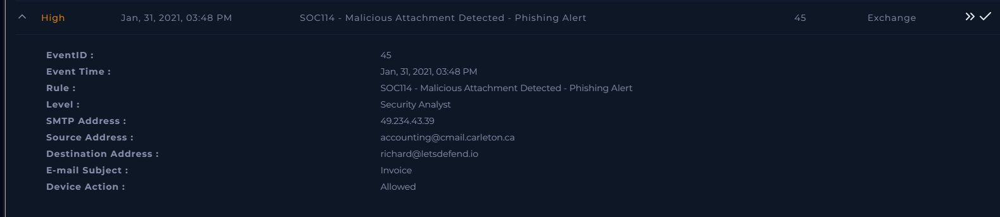
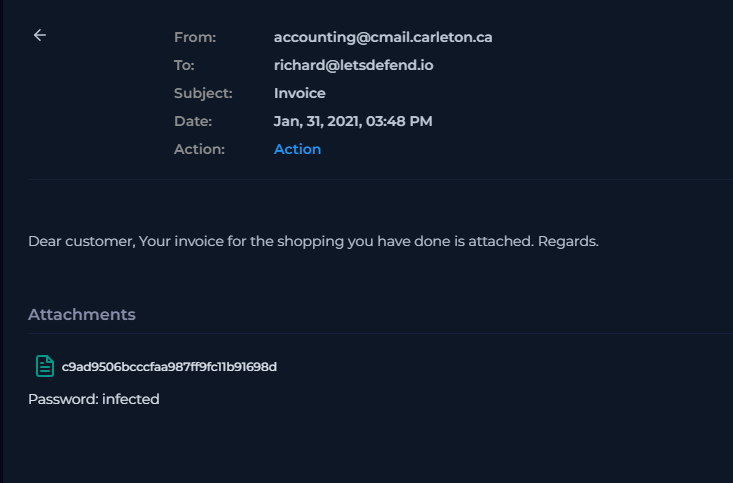
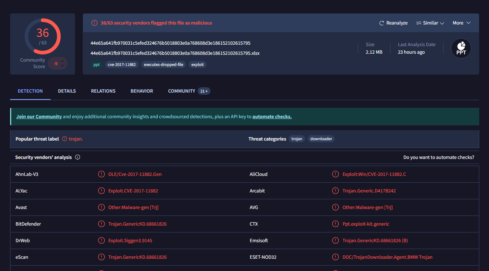
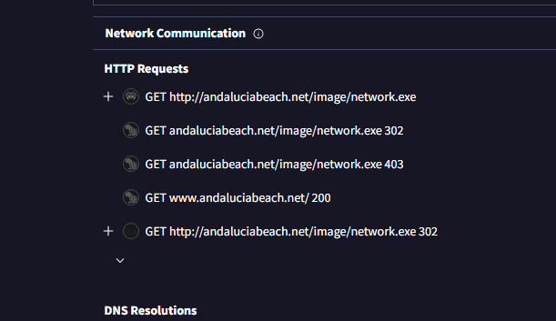
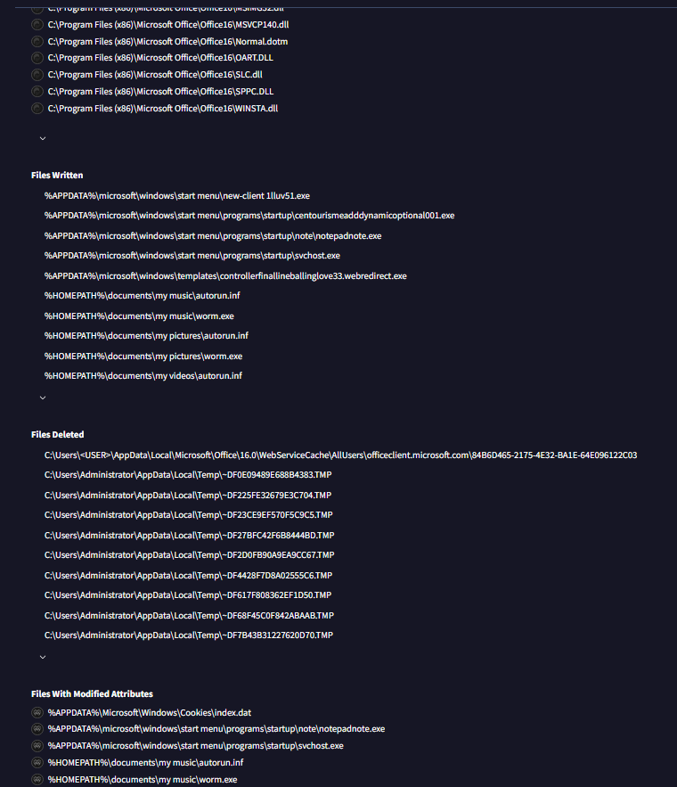
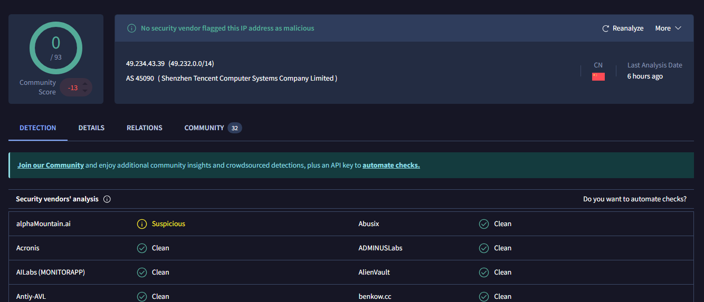
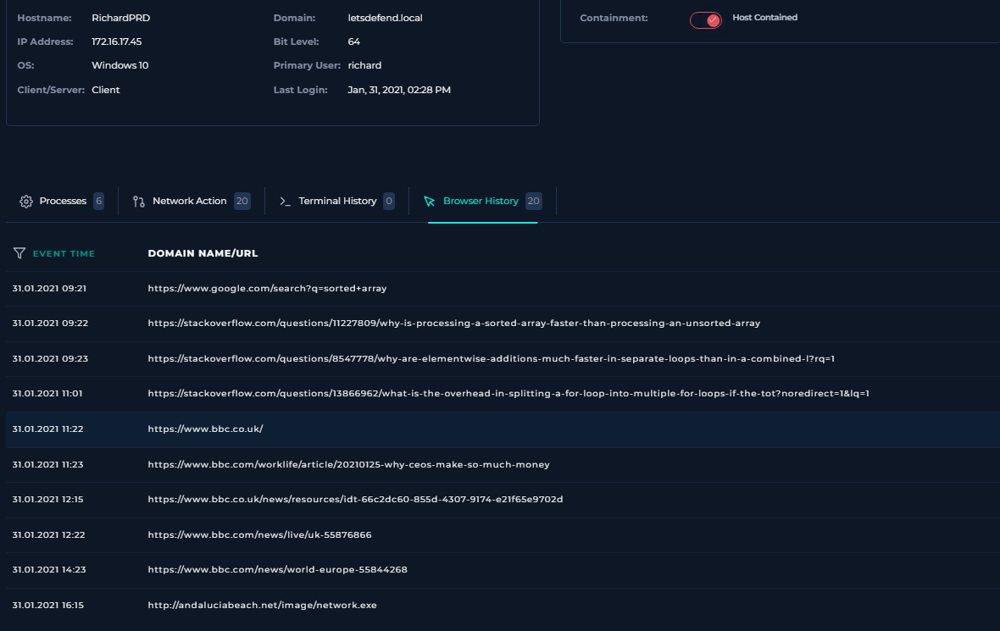
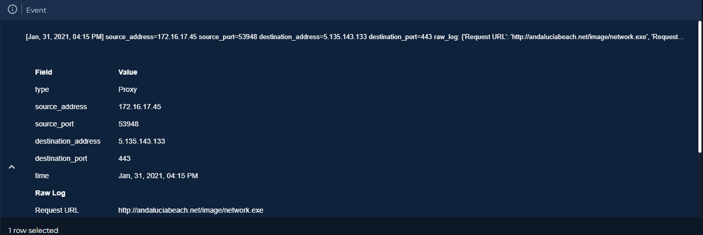
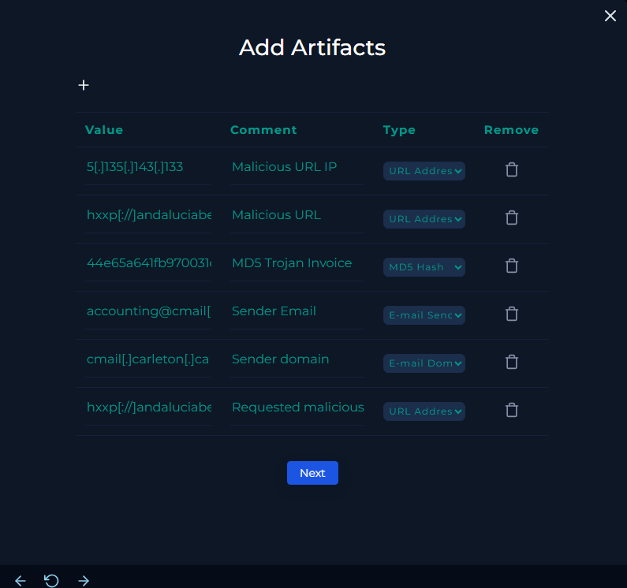
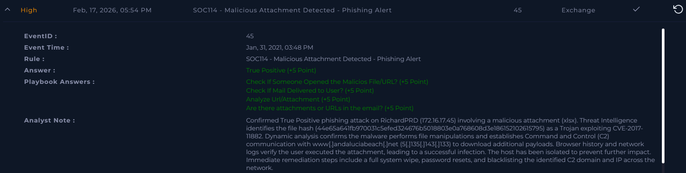

# [Write-up] SOC114 - Malicious Attachment Detected (Phishing Alert)

## Alert Details
| Attribute | Value |
| :--- | :--- |
| **Event ID** | 45 |
| **Event Time** | Jan 31, 2021, 03:48 PM |
| **Rule** | SOC114 - Malicious Attachment Detected |
| **Level** | Security Analyst |
| **SMTP Address** | `49.234.43.39` |
| **Source Address** | `accounting@cmail.carleton.ca` |
| **Destination** | `richard@letsdefend.io` |
| **E-mail Subject** | `Invoice` |
| **Device Action** | **Allowed** |

---

## Incident Analysis

### 1. Initial Triage
The alert identifies a potential phishing email sent to user **Richard**. The email includes an attachment named `Invoice`, a common social engineering tactic used to create a sense of urgency. Given that the device action was **Allowed**, it was critical to determine the nature of the attachment and whether the user interacted with it.

### 2. Email Security Investigation
I examined the email content and confirmed the presence of a malicious attachment. The file is a spreadsheet (`xlsx`) with the following MD5 hash: `44e65a641fb970031c5efed324676b5018803e0a768608d3e186152102615795`. 

### 3. Threat Intelligence & Malware Analysis
I analyzed the file hash using **VirusTotal** and other Threat Intelligence tools:
* **Classification:** The file is flagged as a **Trojan**.
* **Exploit:** It specifically targets **CVE-2017-11882**, a well-known vulnerability in Microsoft Office Equation Editor.
* **Behavior:** Dynamic analysis shows the malware performs file manipulations (opening, modifying, and deleting user files) and establishes communication with a **Command and Control (C2)** server: `www[.]andaluciabeach[.]net` to download additional payloads.

### 4. Endpoint Security (Confirmed Infection)
I identified the target host as **RichardPRD** (`172.16.17.45`). Investigation of the endpoint provided conclusive evidence of infection:
* **Browser History:** Logs show a connection to a domain associated with the Trojan's activity.
* **Execution:** Correlation between network logs and browser history confirms the user **opened the malicious attachment**, triggering the exploit.

### 5. Log Management
By analyzing network logs, I identified the specific IP address used for C2 communication: **5[.]135[.]143[.]133**. This IP served as the delivery point for subsequent malicious stages of the attack.

---

## Case Management & Resolution

* **Contains Attachment or Url?** Yes.
* **Analyze Url/Attachment:** Malicious.
* **Check If Mail Delivered to User?** Delivered.
* **Check If Someone Opened the Malicious File/URL?** Opened.
* **Artifacts:** 

### Analyst Note
**True Positive.** Confirmed True Positive phishing attack on RichardPRD (172.16.17.45) involving a malicious attachment (xlsx). Threat Intelligence identifies the file hash (44e65a641fb970031c5efed324676b5018803e0a768608d3e186152102615795) as a Trojan exploiting CVE-2017-11882. Dynamic analysis confirms the malware performs file manipulations and establishes Command and Control (C2) communication with www[.]andaluciabeach[.]net (5[.]135[.]143[.]133) to download additional payloads. Browser history and network logs verify the user executed the attachment, leading to a successful infection. The host has been isolated to prevent further impact. Immediate remediation steps include a full system wipe, password resets, and blacklisting the identified C2 domain and IP across the network.

---

## Result

---

## Lessons Learned
This incident demonstrates the persistent risk of document-based exploits:

1.  **Vulnerability Management:** The success of this attack relied on **CVE-2017-11882**. Ensuring that all office software is fully patched against known vulnerabilities is a critical defense layer.
2.  **Email Filtering:** Improving the sensitivity of the Email Security Gateway to detect and block macro-enabled or exploit-carrying documents before they reach the inbox.
3.  **User Awareness:** Regular phishing simulations focusing on "Invoice" themes can help employees recognize and report suspicious attachments.
4.  **Host Isolation Speed:** Rapid response via host isolation once C2 traffic was detected prevented the malware from further damaging the host or moving laterally within the network.