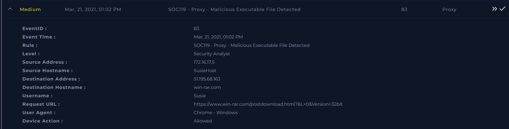
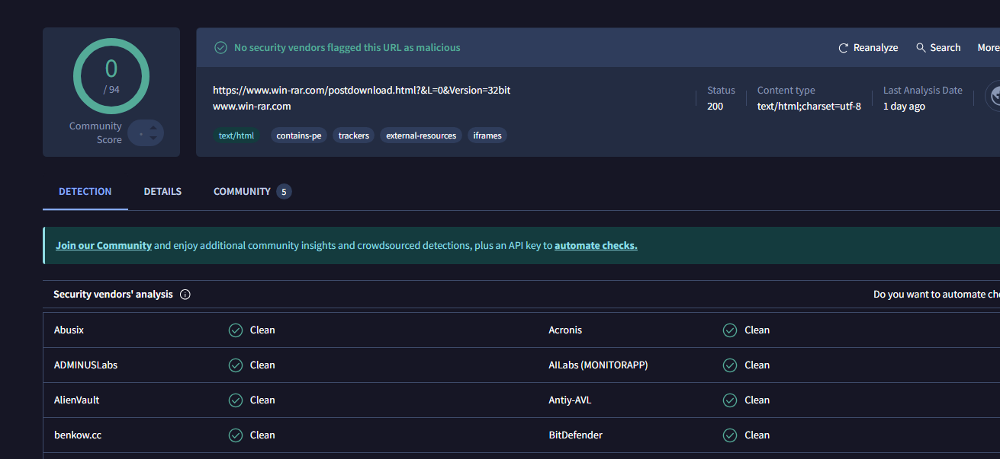
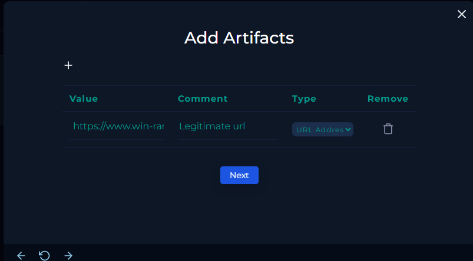
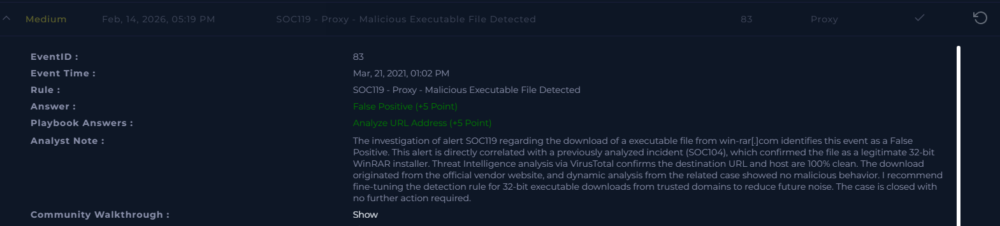

# [Write-up] SOC119 - Proxy - Malicious Executable File Detected

## Alert Details
| Attribute | Value |
| :--- | :--- |
| **Event ID** | 83 |
| **Event Time** | Mar 21, 2021, 01:02 PM |
| **Rule** | SOC119 - Proxy - Malicious Executable File Detected |
| **Level** | Security Analyst |
| **Source IP** | `172.16.17.5` (SusieHost) |
| **Destination Host** | `win-rar.com` |
| **Request URL** | `https://www.win-rar.com/postdownload.html?&L=0&Version=32bit` |
| **Device Action** | **Allowed** |

---

## Incident Analysis

### 1. Initial Triage
The alert identifies a suspicious executable download by user **Susie** from the `win-rar.com` domain. This incident is highly reminiscent of a previous case involving the same user and software. My investigation focused on verifying if this is a recurring False Positive or a new threat masquerading as a legitimate tool.

### 2. Threat Intelligence Verification (OSINT)
I performed a reputation check on the destination URL and host using **VirusTotal**.
* **URL Reputation:** 100% clean.
* **Domain Status:** No security vendors or sandboxes flagged the official `win-rar.com` site as malicious.

### 3. Correlation & Fine-Tuning
This alert is directly correlated with a previously analyzed incident (**SOC104**). In that case, the file was confirmed to be a legitimate 32-bit WinRAR installer download from the official vendor. The current alert was likely triggered by a generic heuristic rule targeting 32-bit executables, which are increasingly uncommon in modern environments but still legitimate for specific compatibility needs.

---

## Case Management & Resolution

* **Analyze URL Address:** Non-malicious.
* **Artifacts:** 

### Result: **False Positive**

#### Analyst Note
The investigation of alert SOC119 regarding the download of a executable file from win-rar[.]com identifies this event as a False Positive. This alert is directly correlated with a previously analyzed incident (SOC104), which confirmed the file as a legitimate 32-bit WinRAR installer. Threat Intelligence analysis via VirusTotal confirms the destination URL and host are 100% clean. The download originated from the official vendor website, and dynamic analysis from the related case showed no malicious behavior. I recommend fine-tuning the detection rule for 32-bit executable downloads from trusted domains to reduce future noise. The case is closed with no further action required.

---

## Result

---

## Lessons Learned
This case highlights the importance of alert correlation and rule optimization:

1.  **Alert Correlation:** Recognizing recurring patterns involving the same user, host, and software allows analysts to resolve incidents faster and maintain high confidence in their findings.
2.  **Fine-Tuning Heuristics:** Heuristic rules (like those flagging all 32-bit EXEs) are useful but often noisy. Whitelisting official, high-reputation vendor domains for common administrative software is a standard practice to reduce "alert fatigue."
3.  **Documentation Value:** Previous write-ups (like SOC104) served as a "source of truth" for this investigation, demonstrating the critical importance of keeping a thorough incident history in the SOC.