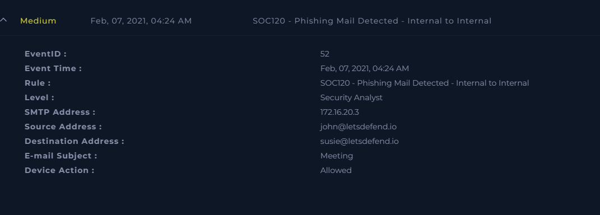
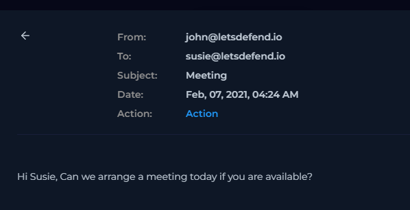
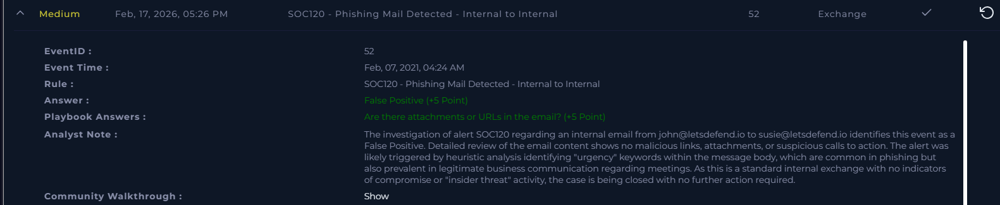

# [Write-up] SOC120 - Phishing Mail Detected - Internal to Internal

## Alert Details
| Attribute | Value |
| :--- | :--- |
| **Event ID** | 52 |
| **Event Time** | Feb 07, 2021, 04:24 AM |
| **Rule** | SOC120 - Phishing Mail Detected - Internal to Internal |
| **Level** | Security Analyst |
| **SMTP Address** | `172.16.20.3` |
| **Source Address** | `john@letsdefend.io` |
| **Destination Address** | `susie@letsdefend.io` |
| **E-mail Subject** | `Meeting` |
| **Device Action** | **Allowed** |

---

## Incident Analysis

### 1. Initial Triage
The alert identifies a potential **Internal to Internal** phishing attempt. This type of alert is particularly sensitive as it could indicate an "Insider Threat" or a situation where one internal account has been compromised and is being used to move laterally within the organization. The email was sent from **John** to **Susie** regarding a "Meeting."

### 2. Email Security Investigation
I performed a comprehensive review of the email content within the Email Security console. Key observations include:
* **Payloads:** There are no attachments or embedded URLs present in the message.
* **Content:** The message body appears to be a routine business coordination regarding a meeting.
* **Trigger Analysis:** The alert was likely triggered by heuristic filters identifying keywords associated with "urgency" (e.g., the word "today"). While urgency is a common social engineering tactic used in phishing, it is also a staple of legitimate, time-sensitive business communication.

### 3. Insider Threat Verification
Since both accounts are internal, I verified the SMTP address (`172.16.20.3`). The traffic originated from the internal network. Given the absence of any malicious technical indicators (no links, no malware) and the context of the message, there is no evidence of account compromise or intentional malicious activity by the sender.

---

## Case Management & Resolution

* **Are there attachments or URLs in the email?** No.
* **Artifacts:** 

### Analyst Note
**False Positive.** The investigation of alert SOC120 regarding an internal email from john@letsdefend.io to susie@letsdefend.io identifies this event as a False Positive. Detailed review of the email content shows no malicious links, attachments, or suspicious calls to action. The alert was likely triggered by heuristic analysis identifying "urgency" keywords within the message body, which are common in phishing but also prevalent in legitimate business communication regarding meetings. As this is a standard internal exchange with no indicators of compromise or "insider threat" activity, the case is being closed with no further action required.

---

## Result

---

## Lessons Learned
This case highlights the challenges of heuristic-based detection in internal communications:

1.  **Heuristic Tuning:** Security systems often rely on keyword matching to detect phishing. This case demonstrates that "urgency" alone is not a sufficient indicator of malice without accompanying technical artifacts (like malicious URLs or files).
2.  **Context is Crucial:** For internal-to-internal alerts, understanding the business relationship and typical communication patterns between users helps distinguish between legitimate requests and potential lateral movement.
3.  **Reducing Alert Fatigue:** By documenting this as a False Positive, we provide data that can be used to fine-tune the email security gateway to reduce the weight of certain keywords when the communication is purely internal and lacks other indicators of compromise.