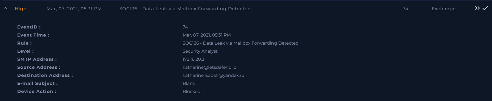
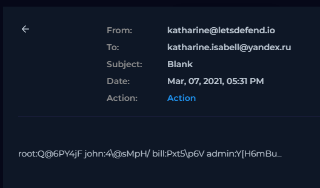
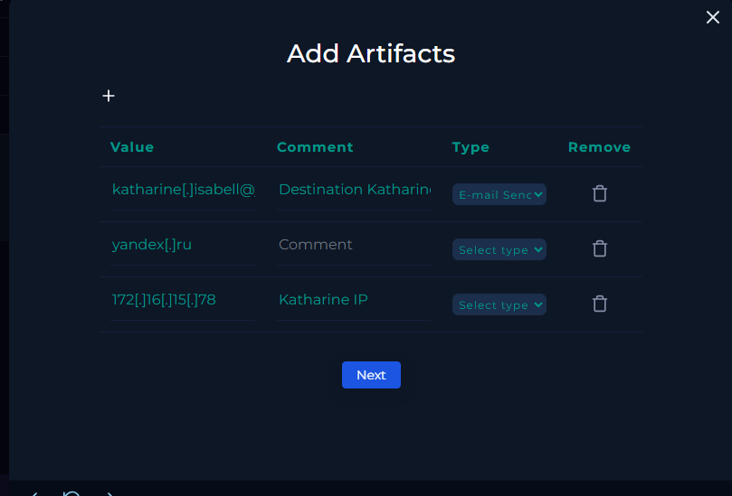
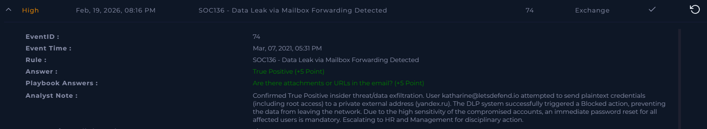

# [Write-up] SOC136 - Data Leak via Mailbox Forwarding Detected

## Alert Details
| Attribute | Value |
| :--- | :--- |
| **Event ID** | 74 |
| **Event Time** | Mar 07, 2021, 05:31 PM |
| **Rule** | SOC136 - Data Leak via Mailbox Forwarding Detected |
| **Level** | Security Analyst |
| **SMTP Address** | `172.16.20.3` |
| **Source Address** | `katharine@letsdefend.io` |
| **Destination Address** | `katharine.isabell@yandex.ru` |
| **E-mail Subject** | `Blank` |
| **Device Action** | **Blocked** |

---

## Incident Analysis

### 1. Initial Triage
The alert identifies a potential data exfiltration attempt involving internal mailbox forwarding. User **Katharine** attempted to send an email from her corporate account to a private external address (`yandex.ru`). This type of activity often signals an "Insider Threat," where sensitive information is intentionally or unintentionally moved outside the secure corporate environment.

### 2. Email Security & Content Discovery
Upon inspecting the contents of the blocked email in the Email Security console, the investigation confirmed a severe policy violation. The message contained a list of plaintext credentials, including usernames and passwords for multiple corporate accounts. Most critically, the list included access details for the **root** user—the account with the highest administrative privileges in the infrastructure.

### 3. Impact Assessment
The unauthorized transmission of administrative credentials poses an extreme risk to the organization. Had the email not been intercepted, an external party (or the user via an insecure private channel) would have gained the ability to compromise the entire network. Fortunately, the Data Loss Prevention (DLP) systems functioned as intended and **Blocked** the transmission before the data left the network.

---

## Case Management & Resolution

* **Contains Attachment or Url?** No.
* **Artifacts:** 

### Analyst Note
**True Positive.** Confirmed True Positive insider threat/data exfiltration. User katharine@letsdefend.io attempted to send plaintext credentials (including root access) to a private external address (yandex.ru). The DLP system successfully triggered a Blocked action, preventing the data from leaving the network. Due to the high sensitivity of the compromised accounts, an immediate password reset for all affected users is mandatory. Escalating to HR and Management for disciplinary action.

---

## Result

---

## Lessons Learned
This incident highlights the critical importance of DLP and access control monitoring:

1.  **DLP Effectiveness:** This case demonstrates that well-tuned Data Loss Prevention rules are the last line of defense against insider threats. Preventing the "egress" of plaintext passwords saved the organization from a major breach.
2.  **Credential Management:** Plaintext storage of passwords by employees is a major security risk. The organization should enforce the use of approved Enterprise Password Managers and implement Multi-Factor Authentication (MFA) to devalue stolen credentials.
3.  **Security Awareness Training:** Whether intentional or not, this action violates fundamental security policies. The user requires immediate intervention, disciplinary review, and mandatory re-training on data handling.
4.  **Privileged Access Management (PAM):** High-level accounts (like root) should be managed through a PAM solution with rotated passwords and session recording, making it harder for individual users to "export" such sensitive data.